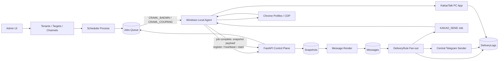
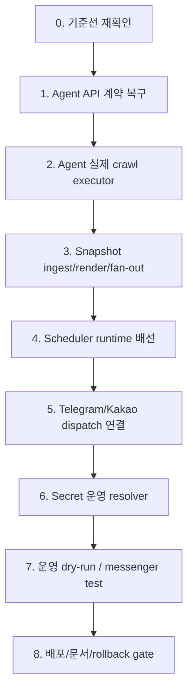
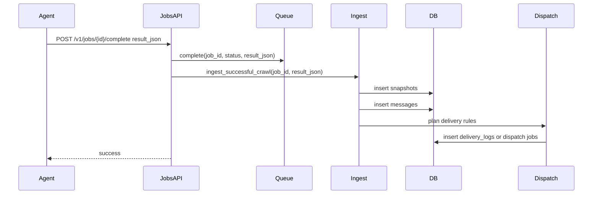

# 리팩토링 개선 방향 상세 실행 문서

작성 시점: 2026-06-15 KST
근거 문서: [refactoring_review_report.md](./refactoring_review_report.md), [detailed_work_order.md](./detailed_work_order.md), [research.md](./research.md), [module-architecture.md](../module-architecture.md)

## 1. 문서 목적

이 문서는 `docs/refactoring/refactoring_review_report.md`에서 확인한 미완료 사항을 실제 개선 작업으로 바꾸기 위한 상세 실행 문서다. 새 아키텍처를 다시 정하는 문서가 아니라, 이미 선택한 방향인 `Cloud Control Plane + Windows Local Agent + 수집/전송 분리 + 중앙 Telegram + Kakao 직렬 queue`를 운영 가능한 상태까지 닫기 위한 작업 지시서다.

핵심 판단은 다음과 같다.

- 현재 리팩토링 방향은 맞다.
- 단위 서비스, 도메인 모델, queue, scheduler, Admin, Agent primitive는 상당히 구현됐다.
- 그러나 판매형 MVP 완료를 막는 live runtime 연결부가 남아 있다.
- 개선의 중심은 "새로 크게 만들기"가 아니라 "끊어진 계약과 실행 흐름을 연결하기"다.

## 2. 목표 상태

최종 목표는 운영자가 현재 일반 Windows PC를 Agent #1로 등록하고, 중앙 서버가 배민/쿠팡 수집 job을 만들며, Agent가 수집한 Snapshot이 서버에서 Message와 DeliveryLog로 이어지는 상태다. Telegram은 중앙 서버가 직접 보내고, Kakao는 Windows Agent queue에서 직렬 전송해야 한다.

목표 흐름은 아래와 같다.



운영자가 체감해야 하는 완료 상태는 다음이다.

1. Admin에서 고객, target, agent, channel, 최근 오류, 인증 필요 상태를 볼 수 있다.
2. 현재 일반 PC Agent가 서버에 등록되고 30~60초마다 heartbeat를 보낸다.
3. Scheduler가 target 주기와 jitter에 따라 CrawlJob을 만든다.
4. Agent가 배민/쿠팡 Chrome profile을 열고 실제 수집을 수행한다.
5. 수집 결과는 서버에 Snapshot으로 저장된다.
6. Snapshot 하나에서 여러 DeliveryRule로 메시지가 fan-out된다.
7. Telegram은 중앙 서버의 sendMessage로 전송되고 DeliveryLog가 남는다.
8. Kakao는 Agent의 FIFO queue로 직렬 전송되고 DeliveryLog가 남는다.
9. 인증 만료, 채널 오류, Agent offline, queue lag가 Admin/metrics/runbook으로 이어진다.
10. Secret 값은 DB, 로그, 설정 파일, error envelope, screenshot artifact에 평문으로 남지 않는다.

## 3. 개선 원칙

아래 원칙은 구현 순서보다 우선한다. 구현이 쉬워 보여도 이 원칙을 깨면 다시 운영 리스크가 생긴다.

### 3.1 기존 검증 자산을 재사용한다

- 배민 `crawler.py`, `parser.py`, `message.py`, `sender.py`의 검증된 동작은 유지한다.
- 쿠팡 전용 로직은 `src/rider_crawl/platforms/coupang/` 경계를 유지한다.
- 새 Agent worker는 기존 crawler/parser/renderer를 감싸야지, 별도 파서를 다시 만들면 안 된다.
- 기존 UI 1회 실행 결과와 메시지 형태가 달라지는 변경은 의도와 승인 없이 하지 않는다.

### 3.2 Agent는 outbound-only다

- 서버가 고객 PC의 CDP 포트나 KakaoTalk UI에 직접 붙으면 안 된다.
- Agent는 `register`, `heartbeat`, `claim`, `complete`, `events`를 모두 outbound HTTPS로 보낸다.
- Agent는 `rider_server`를 import하지 않는다. 서버 enum이 필요하면 plain string 상수로 미러링한다.

### 3.3 Secret은 값이 아니라 참조로 이동한다

- DB와 설정 JSON에는 `*_ref`만 남긴다.
- Telegram bot token, webhook secret, Coupang password, Gmail OAuth token, OTP는 로그와 예외 메시지에 남기지 않는다.
- 운영 secret resolver가 없을 때는 fail-closed가 맞다. 다만 운영 전에는 실제 resolver를 반드시 붙인다.

### 3.4 상태 전이는 오발송보다 중단을 우선한다

- parser 필수 데이터가 없으면 잘못된 실적 메시지를 보내지 않는다.
- Kakao room이 없거나 애매하면 임의 방으로 보내지 않는다.
- Telegram channel이 미등록, 미검증, 중복 topic이면 보내지 않는다.
- 인증 상태가 의심되면 `AUTH_REQUIRED` 또는 `USER_ACTION_PENDING`로 세워야 한다.

### 3.5 작은 단위로 닫는다

이번 개선은 한 번에 크게 갈아엎으면 위험하다. 아래 순서로 "계약 -> 실행 -> 영속 -> 전송 -> 운영 검증"을 차례대로 닫는다.

1. 서버/Agent API 계약을 맞춘다.
2. Agent가 실제 crawl job을 실행하게 한다.
3. 서버가 complete 결과를 Snapshot/Message/DeliveryLog로 저장한다.
4. Telegram/Kakao 전송을 live dispatch로 묶는다.
5. 운영 dry-run과 release gate를 채운다.

## 4. 현재 갭 요약

| ID | 갭 | 영향 | 우선순위 | 개선 방향 |
| --- | --- | --- | --- | --- |
| G1 | `/v1/agents/register`, `/v1/agents/heartbeat` 서버 API 없음 | Agent #1 운영 검증 불가 | 최상 | `src/rider_server/api/agents.py` 추가 |
| G2 | 기본 job executor가 실제 crawl job을 미지원 처리 | CrawlJob이 성공할 수 없음 | 최상 | `src/rider_agent/workers/crawl_worker.py` 구현 |
| G3 | `jobs.complete(result_json)` 이후 Snapshot/Message/DeliveryLog ingest 없음 | 수집 결과가 운영 데이터로 이어지지 않음 | 최상 | server-side ingest service 구현 |
| G4 | Scheduler service는 있으나 별도 process/compose 배선 없음 | 자동 job 생성 없음 | 높음 | scheduler entrypoint와 compose service 추가 |
| G5 | 중앙 Telegram outbound dispatch loop 미연결 | webhook/register만 있고 실제 중앙 발송이 닫히지 않음 | 높음 | dispatch worker와 send adapter 연결 |
| G6 | Kakao queue primitive와 legacy UI 경로가 분리됨 | DeliveryLog 없는 UI 전송 경로 잔존 | 높음 | KAKAO_SEND job과 결과 보고 연결 |
| G7 | 운영 secret resolver 없음 | production webhook/send/credential 해석 불가 | 높음 | SecretBackend interface와 resolver 주입 |
| G8 | live dry-run 기준선이 placeholder | 운영 회귀 검증 근거 부족 | 중간 | 운영 PC에서 실측값 채우기 |
| G9 | wheel package가 `rider_crawl`만 포함 | wheel 배포 시 server/agent 누락 위험 | 중간 | 배포 방식 결정 후 packaging 정리 |
| G10 | README 일부가 현재 코드와 불일치 | 운영자 혼선 | 중간 | README와 runbook 정합화 |

## 5. 전체 실행 순서

아래 순서를 권장한다. 앞 단계가 뒤 단계의 검증 기반이 되기 때문이다.



단, 일부 작업은 병렬 가능하다.

- Agent API 계약과 SecretBackend 설계는 병렬 가능하다.
- Scheduler process 배선과 Agent crawl executor는 병렬 가능하다.
- README/runbook 정리는 기능 구현과 병렬 가능하다.
- live dry-run은 실제 Agent/dispatch 연결 후에만 의미가 있다.

## 6. Workstream A - Agent API 계약 복구

### 6.1 목표

에이전트 클라이언트가 이미 호출하는 `POST /v1/agents/register`, `POST /v1/agents/heartbeat`를 서버가 실제로 제공한다. 이 단계가 끝나면 "현재 일반 PC Agent가 중앙 서버에 등록되고 heartbeat를 보고한다"는 MVP 기준을 검증할 수 있어야 한다.

### 6.2 현재 상태

- Agent registration client는 `/v1/agents/register`를 호출한다.
- Agent heartbeat client는 `/v1/agents/heartbeat`를 호출한다.
- 서버는 현재 `/v1/jobs/*`, `/v1/telegram/webhook`만 제공한다.
- `agents` 테이블에는 `last_heartbeat_at`, `capacity_json`이 있다.
- `browser_profiles` 테이블은 `agent_id`, `target_id`, `profile_path_ref`, `cdp_port`, `state`를 담을 수 있다.
- Admin/metrics는 heartbeat 값을 보여줄 수 있는 기반을 갖고 있다.

### 6.3 구현 방향

새 파일을 추가한다.

- `src/rider_server/api/agents.py`
- 필요하면 `src/rider_server/services/agent_registration_service.py`
- 필요하면 `src/rider_server/services/agent_heartbeat_service.py`
- 필요하면 `src/rider_server/services/agent_repository_postgres.py`

`create_app()`에는 새 router를 포함한다.

```python
app.include_router(agents_router)
```

### 6.4 API 계약

#### `POST /v1/agents/register`

요청:

```json
{
  "registration_code": "one-time-code",
  "machine_fingerprint": "opaque-machine-id",
  "hostname": "WORK-PC-01",
  "os": "Windows 11",
  "agent_version": "0.1.0"
}
```

응답:

```json
{
  "agent_id": "agent_...",
  "agent_token": "secret-token-returned-once",
  "tenant_scope": ["tenant_..."],
  "config_version": 1
}
```

규칙:

- registration code는 1회성이다.
- 응답에 token은 최초 등록 때만 나온다.
- 서버 로그에는 registration code와 token이 남지 않는다.
- 이미 등록된 machine이면 정책을 명확히 정한다.
  - 권장: 같은 machine fingerprint와 유효 등록 코드면 기존 Agent rotate 또는 rebind를 명시적으로 수행한다.
  - 애매한 중복이면 fail-closed로 `409 CONFLICT`를 반환한다.
- 등록 성공 시 `agents.status = ONLINE` 또는 `REGISTERED` 중 하나를 정한다. heartbeat가 들어와야 online으로 볼지, 등록 시점부터 online으로 볼지 테스트가 고정해야 한다.

#### `POST /v1/agents/heartbeat`

인증:

```http
Authorization: Bearer <agent_token>
```

요청:

```json
{
  "agent_id": "agent_...",
  "metrics": {
    "cpu_percent": 12.3,
    "memory_percent": 44.2
  },
  "capabilities": ["CRAWL_BAEMIN", "CRAWL_COUPANG", "KAKAO_SEND"],
  "active_jobs": [
    {
      "job_id": "job_...",
      "lease_expires_at": "2026-06-15T00:00:00Z"
    }
  ],
  "kakao_status": {
    "state": "idle",
    "queue_depth": 0
  },
  "browser_profiles": [
    {
      "id": "profile_...",
      "target_id": "target_...",
      "state": "READY",
      "cdp_port": 9222
    }
  ]
}
```

응답:

```json
{
  "server_time": "2026-06-15T00:00:00Z",
  "config_version": 1,
  "commands": []
}
```

규칙:

- token은 body에 넣지 않는다.
- `agent_id` body 값과 bearer token이 가리키는 agent가 다르면 `403` 또는 `409`로 거부한다.
- heartbeat 수신 시 `agents.last_heartbeat_at`, `agents.capacity_json`, `agents.status`를 갱신한다.
- `active_jobs`가 있으면 lease 연장 정책을 붙일 수 있다. 최소 구현은 저장/관측만 하고, lease 연장은 별도 task로 분리해도 된다.
- `browser_profiles`는 raw local path를 저장하지 않는다. `profile_path_ref`나 opaque profile id만 쓴다.

### 6.5 테스트

추가할 테스트:

- `tests/server/test_agents_api.py`
  - registration 성공
  - registration code 누락/오류/재사용 거부
  - registration 응답에 필요한 필드 존재
  - token/code가 에러 응답과 로그에 노출되지 않음
  - heartbeat 성공 시 `last_heartbeat_at` 갱신
  - heartbeat bearer 누락/오류는 401
  - bearer agent와 body agent 불일치는 거부
  - heartbeat payload에 raw path/secret이 있으면 저장하지 않거나 redaction
- `tests/server/test_server_app.py`
  - `/v1/agents/register`, `/v1/agents/heartbeat` route 등록 확인
- `tests/agent/test_registration.py`, `tests/agent/test_heartbeat.py`
  - 기존 client 계약과 server route schema가 어긋나지 않도록 e2e 또는 contract fake 추가

검증 명령:

```powershell
.venv\Scripts\python.exe -m pytest tests/server/test_agents_api.py tests/agent/test_registration.py tests/agent/test_heartbeat.py -q
```

### 6.6 완료 기준

- `rider_agent register --code <code>`가 실제 FastAPI 서버에 대해 성공한다.
- `runtime/state/agent/agent_config.json`에는 token이 아닌 agent 식별 정보만 저장된다.
- token은 DPAPI store에 저장된다.
- Admin agents 화면에서 `last_heartbeat_at`이 갱신된다.
- token/code가 로그, 에러 응답, DB text 필드에 평문으로 남지 않는다.

## 7. Workstream B - Agent 실제 crawl executor

### 7.1 목표

`CRAWL_BAEMIN`, `CRAWL_COUPANG` job을 Agent가 실제로 실행한다. 기본 unsupported executor가 운영 경로에 남아 있으면 안 된다.

### 7.2 현재 상태

- `JobRunner`와 `claim/complete/events` client는 있다.
- `BrowserProfileManager`는 target별 profile/port 관리를 할 수 있다.
- Baemin auth와 Coupang Gmail 2FA primitive는 있다.
- Kakao worker는 별도 queue로 있다.
- 그러나 기본 executor는 `UNSUPPORTED_JOB_TYPE` 실패만 반환한다.

### 7.3 새 모듈 제안

```text
src/rider_agent/workers/crawl_worker.py
```

책임:

- Job payload 해석
- target별 BrowserProfile 확보
- 플랫폼별 crawler 호출
- 수집 결과를 서버 Snapshot payload 형태로 변환
- 인증 필요/프로필 오류/파서 오류를 명확한 error_code로 분류
- secret/raw HTML/민감 screenshot을 job result에 넣지 않음

### 7.4 Job payload 권장 형태

Scheduler가 만드는 job에는 최소한 다음 값이 필요하다.

```json
{
  "target_id": "target_...",
  "tenant_id": "tenant_...",
  "platform": "baemin",
  "platform_account_id": "acct_...",
  "primary_url": "https://...",
  "expected_display_name": "센터 또는 상점명",
  "browser_profile_id": "profile_...",
  "browser_profile_ref": "opaque-ref",
  "timeout_seconds": 60,
  "parser_version": "baemin-v1"
}
```

주의:

- password, OTP, Gmail token, Telegram token은 payload에 넣지 않는다.
- Agent가 로컬에서 필요한 Gmail token은 DPAPI/local secure store ref로 찾는다.
- profile path는 가능하면 raw path 대신 local opaque ref로 전달한다.

### 7.5 Baemin 실행 흐름

1. job payload에서 `target_id`, `primary_url`, expected center 정보를 읽는다.
2. `BrowserProfileManager.ensure_profile()`로 Chrome profile/CDP endpoint를 확보한다.
3. Baemin 로그인/인증 상태를 확인한다.
4. 휴대폰 인증 또는 로그인 필요가 감지되면 crawl을 멈추고 `AUTH_REQUIRED` 결과를 보낸다.
5. 인증 상태가 정상일 때 기존 Baemin crawler/parser를 호출한다.
6. 필수 데이터 누락 시 `PARSER_MISSING_DATA`로 실패한다.
7. 정상 수집 시 normalized snapshot payload를 반환한다.

권장 error_code:

| 코드 | 의미 | retry |
| --- | --- | --- |
| `AUTH_REQUIRED` | 사용자 재인증 필요 | no, 사용자 조치 필요 |
| `USER_ACTION_PENDING` | 인증 브라우저를 열었고 사용자 조치 대기 | no, 상태 유지 |
| `PROFILE_UNAVAILABLE` | profile/port 확보 실패 | yes, 제한 retry |
| `CDP_UNREACHABLE` | Chrome CDP 연결 실패 | yes |
| `PARSER_MISSING_DATA` | 필수 실적 데이터 누락 | no 또는 breaker |
| `CENTER_MISMATCH` | 기대 센터/상점명 불일치 | no |
| `CRAWL_TIMEOUT` | 페이지 로드/수집 timeout | yes |

### 7.6 Coupang 실행 흐름

1. `platform = coupang` job을 받는다.
2. target의 expected store/center 값을 확인한다.
3. Chrome profile을 확보한다.
4. 로그인/2FA 상태를 확인한다.
5. Gmail 2FA가 필요한 경우 mailbox별 lock을 획득한다.
6. Gmail token ref를 고객/메일함 단위로 해석한다.
7. 자동 복구 가능하면 1회 복구하고, 반복 인증 storm은 막는다.
8. peak-dashboard 또는 현재 정본 URL에서 수집한다.
9. expected store/center mismatch면 전송하지 않는다.
10. Snapshot payload를 반환한다.

### 7.7 Agent startup 배선

`run_agent()`에서 현재 Kakao worker는 조건부로 붙는다. 여기에 crawl executor map을 구성한다.

```text
effective_execute_job =
  KAKAO_SEND -> KakaoSenderWorker
  CRAWL_BAEMIN -> CrawlWorker.execute_baemin
  CRAWL_COUPANG -> CrawlWorker.execute_coupang
  AUTH_CHECK -> Baemin/Coupang auth primitive
  OPEN_AUTH_BROWSER -> auth browser primitive
  fallback -> default_execute_job
```

운영 경로에서는 `CRAWL_BAEMIN`, `CRAWL_COUPANG`이 fallback으로 떨어지면 실패로 본다.

### 7.8 테스트

추가할 테스트:

- `tests/agent/test_crawl_worker.py`
  - Baemin 정상 snapshot payload 생성
  - Coupang 정상 snapshot payload 생성
  - auth required면 crawler 호출하지 않음
  - center/store mismatch면 fail-closed
  - profile 중복/port 사용 중이면 fail-closed
  - secret/token/raw html이 result에 없음
  - unsupported job fallback은 crawl job에 쓰이지 않음
- `tests/agent/test_job_loop.py`
  - run_agent composition이 crawl worker를 주입함
  - KAKAO_SEND와 crawl job routing이 서로 충돌하지 않음

### 7.9 완료 기준

- fake crawler를 사용한 Agent job loop e2e에서 `CRAWL_BAEMIN`과 `CRAWL_COUPANG`이 success complete를 보낸다.
- auth required scenario는 complete failed 또는 held 상태로 서버에 보고되고, Admin에서 인증 필요로 보인다.
- 실제 운영 PC에서 dry-run 1회가 가능하다.

## 8. Workstream C - Snapshot ingest, render, fan-out

### 8.1 목표

Agent가 `complete`로 올린 수집 결과가 서버에서 `snapshots`, `messages`, `delivery_logs`로 이어진다. 지금처럼 job result JSON에만 머물면 운영자가 "무엇을 수집했고 어디로 보냈는지"를 추적할 수 없다.

### 8.2 새 서비스 제안

```text
src/rider_server/services/job_result_ingest_service.py
src/rider_server/services/snapshot_repository_postgres.py
src/rider_server/services/message_repository_postgres.py
src/rider_server/services/delivery_log_repository_postgres.py
src/rider_server/services/dispatch_orchestrator.py
```

역할:

- `JobResultIngestService`: job complete 결과를 검증하고 Snapshot으로 저장
- `MessageRenderService`: Snapshot에서 Message 생성
- `DispatchFanoutService`: DeliveryRule에 따라 DispatchJob 또는 DeliveryLog 계획 생성
- `IdempotentDeliveryService`: dedup key로 중복 발송 차단
- `DispatchOrchestrator`: 위 서비스를 하나의 transaction 또는 명확한 단계로 연결

### 8.3 ingest 입력 스키마

Agent complete의 `result_json`에는 최소한 다음이 있어야 한다.

```json
{
  "schema_version": 1,
  "result_type": "snapshot",
  "target_id": "target_...",
  "platform": "baemin",
  "collected_at": "2026-06-15T00:00:00Z",
  "parser_version": "baemin-v1",
  "quality_state": "OK",
  "normalized_json": {
    "current_screen": {}
  },
  "artifact_refs": []
}
```

규칙:

- `normalized_json`에는 secret이 없어야 한다.
- `text` 원문은 Message 생성 이후 저장 정책을 따른다. DB에는 `text_hash`, `text_redacted_preview` 중심으로 둔다.
- raw HTML, screenshot, cookie, local path는 기본 result에 넣지 않는다. 필요한 경우 artifact store ref만 둔다.

### 8.4 처리 순서



### 8.5 transaction 정책

권장 정책:

- job status update와 snapshot insert는 같은 transaction이면 가장 좋다.
- 어렵다면 job complete 후 ingest 실패를 별도 recoverable 상태로 남긴다.
- ingest 실패가 job success를 완전히 덮어쓰면 안 된다. 수집 성공과 서버 처리 실패를 구분해야 한다.

상태 예:

| 상태 | 의미 |
| --- | --- |
| `JOB_SUCCEEDED_INGEST_PENDING` | Agent 수집 성공, 서버 ingest 대기 |
| `INGESTED` | Snapshot/Message 생성 완료 |
| `DISPATCH_PLANNED` | DeliveryRule 기반 전송 계획 생성 |
| `DISPATCHED` | 전송 완료 또는 중복 차단 기록 완료 |
| `INGEST_FAILED` | result schema 오류 또는 DB 처리 실패 |

현재 상태 모델을 크게 바꾸기 어렵다면 `jobs.result_json`에 ingest status를 보강하지 말고 별도 `delivery_logs`/audit/event로 추적해도 된다. 중요한 것은 수집 성공과 전송 실패를 섞지 않는 것이다.

### 8.6 dedup key

DeliveryLog dedup key는 최소한 아래 요소를 포함해야 한다.

```text
tenant_id
target_id
message_hash
messenger_channel_id
template_version
```

선택 요소:

- platform
- delivery_rule_id
- message_thread_id
- send_only_on_change policy version

절대 하면 안 되는 것:

- message text 원문 전체를 dedup key로 저장
- Telegram token 또는 Kakao room raw secret성 값을 key에 포함
- target이 빠져 다른 고객 메시지가 섞이는 key 설계

### 8.7 테스트

추가할 테스트:

- `tests/server/test_job_result_ingest.py`
  - valid result -> snapshot insert
  - snapshot -> message render
  - active delivery rules -> delivery jobs/logs 생성
  - disabled rule은 생성 안 됨
  - duplicate message hash는 duplicate blocked log
  - malformed result는 fail-closed
  - secret pattern이 normalized/result/log에 있으면 redacted 또는 거부
- `tests/server/test_jobs_api.py`
  - complete success 후 ingest service 호출
  - ingest 실패 시 error envelope과 job 상태 정책 확인

### 8.8 완료 기준

- `POST /v1/jobs/{id}/complete`로 snapshot result를 보내면 DB에 Snapshot, Message, DeliveryLog 또는 DispatchJob이 생긴다.
- 같은 Snapshot/Message 재처리는 중복 발송으로 이어지지 않는다.
- Admin에서 최근 오류와 DeliveryLog 상태를 확인할 수 있다.

## 9. Workstream D - Scheduler runtime 배선

### 9.1 목표

Scheduler가 단순 service가 아니라 실제 process로 실행되어 due target을 주기적으로 보고 CrawlJob을 만든다.

### 9.2 현재 상태

- scheduler policy/service는 구현되어 있다.
- due target, subscription gate, breaker, capacity, idempotent enqueue 기반이 있다.
- 하지만 `docker-compose.yml`에는 scheduler가 placeholder로 남아 있다.

### 9.3 구현 방향

새 entrypoint:

```text
src/rider_server/scheduler/__main__.py
```

또는:

```text
src/rider_server/worker_scheduler.py
```

권장 CLI:

```powershell
python -m rider_server.scheduler
```

환경변수:

| 변수 | 의미 | 기본 |
| --- | --- | --- |
| `DATABASE_URL` | PostgreSQL 연결 | 필수 |
| `SCHEDULER_TICK_SECONDS` | tick 주기 | 10 또는 30 |
| `SCHEDULER_BATCH_SIZE` | 한 tick의 최대 target 수 | 100 |
| `SCHEDULER_LEADER_LOCK_KEY` | 단일 scheduler lock key | 선택 |
| `APP_ENV` | production/development | development |

### 9.4 process lock

MVP에서는 scheduler process를 1개만 띄우면 충분하다. 그래도 중복 실행 방어가 필요하다.

선택지:

1. PostgreSQL advisory lock 사용
2. DB row 기반 lease 사용
3. compose에서 replica 1개로 제한하고 추후 lock 추가

권장:

- MVP라도 advisory lock을 넣는다.
- lock 획득 실패 시 process는 대기하면서 metric만 남긴다.
- lock이 없으면 두 scheduler가 같은 target에 job을 중복 생성할 수 있다. idempotent enqueue가 있어도 운영자가 이해하기 어렵다.

### 9.5 compose 추가

`deploy/docker-compose.yml`에 scheduler service를 추가한다.

```yaml
scheduler:
  build:
    context: ..
    dockerfile: deploy/Dockerfile.server
  image: rider-server:dev
  command: ["python", "-m", "rider_server.scheduler"]
  env_file:
    - ./env/backend-api.env
  restart: unless-stopped
```

주의:

- 현재 Dockerfile.server는 SQLAlchemy/Alembic/asyncpg를 설치하지 않는 것으로 보인다. 서버 runtime이 DB를 실제로 쓰려면 server extra 의존성이 이미지에 포함돼야 한다.
- Dockerfile이 FastAPI/uvicorn만 설치하는 경량 이미지라면 scheduler는 import 단계에서 실패할 수 있다. Docker build 검증이 필요하다.

### 9.6 테스트

추가할 테스트:

- `tests/server/test_scheduler_entrypoint.py`
  - env를 읽어 scheduler runner 구성
  - 한 tick 실행 후 정상 종료 가능한 `--once` 모드
  - sleep/loop는 주입 가능
- `tests/server/test_scheduler_runtime.py`
  - due target -> queue enqueue
  - subscription inactive target skip
  - breaker open target skip
  - capacity 없는 agent면 skip 또는 delayed
  - duplicate tick에도 중복 job 없음

### 9.7 완료 기준

- `python -m rider_server.scheduler --once`가 fake/in-memory 또는 test DB에서 한 tick을 실행한다.
- compose로 backend-api와 scheduler를 함께 띄울 수 있다.
- 100 fake target load smoke에서 job storm 없이 jitter가 분산된다.

## 10. Workstream E - Telegram 중앙 dispatch

### 10.1 목표

Telegram은 더 이상 Agent별 `getUpdates` poller가 아니라 중앙 서버의 webhook/register/sendMessage 경로로 운영한다.

### 10.2 현재 상태

- `/v1/telegram/webhook`는 있다.
- `/register <code>` 파싱과 channel registration service가 있다.
- `CentralTelegramSender`는 send-only adapter와 topic collision 검출을 제공한다.
- 그러나 live dispatch worker와 DeliveryLog 기록이 연결되어 있지 않다.
- legacy UI 경로에는 poller가 남아 있다.

### 10.3 구현 방향

새 dispatch worker를 만든다.

```text
src/rider_server/services/telegram_dispatch_worker.py
```

또는 일반 dispatch worker 안에서 Telegram channel을 처리한다.

```text
src/rider_server/services/dispatch_worker.py
```

처리 순서:

1. `DeliveryLog` 또는 `DispatchJob` 중 `channel.messenger = telegram`, `status = PENDING`을 가져온다.
2. channel state가 `ACTIVE`인지 확인한다.
3. `telegram_bot_token_ref`를 secret resolver로 해석한다.
4. `CentralTelegramSender.send()`를 호출한다.
5. 성공 시 `DeliveryLog.status = SENT`, `sent_at` 기록.
6. 실패 시 `error_code`, retryable 여부, next_retry_at 기록.

### 10.4 channel lifecycle

권장 상태:

```text
PENDING -> REGISTERED -> VERIFIED -> ACTIVE -> INACTIVE
```

현재 문서에는 `PENDING -> VERIFIED -> ACTIVE -> INACTIVE`가 있다. `/register <code>`가 chat_id/thread_id를 저장한 직후를 `PENDING` 그대로 둘지 `REGISTERED`로 둘지는 선택해야 한다.

권장:

- `PENDING`: 코드 발급됨, 아직 Telegram chat 매핑 없음
- `REGISTERED`: `/register`로 chat_id/thread_id 저장됨
- `VERIFIED`: 테스트 메시지 성공
- `ACTIVE`: 운영 전송 가능
- `INACTIVE`: 전송 중지

기존 상태 모델을 크게 바꾸기 싫다면 `PENDING`과 `VERIFIED` 사이를 별도 field로 표현해도 된다. 중요한 것은 테스트 메시지 전 운영 활성화를 막는 것이다.

### 10.5 legacy poller 격리

현재 UI의 Telegram poller는 기존 로컬 앱 호환을 위해 남길 수 있다. 다만 판매형 운영의 기본 경로와 섞이면 안 된다.

권장:

- local UI legacy mode: 기존 poller 유지
- cloud mode: poller 비활성, 중앙 webhook/register/send-only 사용
- README와 Admin에 "같은 bot token을 legacy poller와 central webhook에서 동시에 쓰지 말 것" 명시

### 10.6 테스트

추가할 테스트:

- `tests/server/test_telegram_dispatch_worker.py`
  - active channel send 성공 -> DeliveryLog SENT
  - inactive/unverified channel은 HELD
  - secret resolver None -> fail-closed
  - Telegram API retry-after -> retryable backoff
  - bad chat id -> non-retryable
  - duplicate topic collision이면 activation 거부
- `tests/test_telegram_commands.py` 또는 관련 legacy test
  - legacy poller가 cloud mode에서 켜지지 않는 설정 경계

### 10.7 완료 기준

- `/register <code>`로 channel 매핑이 된다.
- test-send가 성공해야 ACTIVE가 된다.
- 실제 DeliveryLog가 `SENT` 또는 실패 상태를 남긴다.
- 같은 bot token을 여러 Agent가 polling하는 구조가 판매형 경로에 없다.

## 11. Workstream F - Kakao queue와 DeliveryLog

### 11.1 목표

Kakao 전송은 Agent의 FIFO queue에서 직렬 처리되고, 결과가 서버 DeliveryLog에 남는다.

### 11.2 현재 상태

- `KakaoSenderWorker`는 단일 consumer queue primitive를 제공한다.
- legacy sender는 카카오톡 PC 앱 UI 자동화를 수행한다.
- 기존 UI 경로는 아직 중앙 `KakaoSendJob -> DeliveryLog` 구조가 아니다.

### 11.3 job 분리

서버는 Telegram을 직접 보낼 수 있지만 Kakao는 Windows UI가 필요하므로 Agent job으로 보내야 한다.

권장 job type:

```text
KAKAO_SEND
```

payload:

```json
{
  "delivery_log_id": "dlog_...",
  "tenant_id": "tenant_...",
  "channel_id": "channel_...",
  "kakao_room_ref": "opaque-room-ref-or-name-policy",
  "message_text": "redacted-safe message to send",
  "message_hash": "sha256...",
  "timeout_seconds": 30
}
```

주의:

- Kakao는 실제 메시지 본문을 UI에 붙여넣어야 하므로 Agent payload에 메시지 텍스트가 필요하다.
- 이 텍스트는 secret이 아니어야 하고, 운영 식별자가 포함될 수 있으므로 로그에는 전문을 남기지 않는다.
- job event나 error에는 message 전문을 넣지 않는다.
- diagnostic에는 방명/본문 대신 count, 상태 코드, sanitized artifact ref만 둔다.

### 11.4 오류 분류

문서의 오류 분류를 구현 표면에 맞춘다.

| error_code | 의미 | retry | 운영 조치 |
| --- | --- | --- | --- |
| `ROOM_NOT_FOUND` | 정확한 방을 찾지 못함 | no | 방 이름/초대 확인 |
| `ROOM_AMBIGUOUS` | 같은 이름 방이 2개 이상 | no | 방 이름 고유화 |
| `KAKAO_NOT_LOGGED_IN` | PC Kakao 로그아웃 | no | 운영자 로그인 |
| `UI_TIMEOUT` | UI 응답 timeout | yes | 제한 retry 후 alert |
| `CLIPBOARD_ERROR` | 클립보드 백업/복구 실패 | maybe | 수동 점검 |
| `WINDOW_ENUM_FAILED` | 창 목록 조회 실패 | yes | OS/UI 상태 점검 |
| `SEND_CONFIRM_UNKNOWN` | 전송 성공 여부 불확실 | no 또는 manual | 중복 방지를 위해 보수 처리 |

### 11.5 DeliveryLog 상태

권장 상태:

```text
PENDING -> CLAIMED -> SENT
PENDING -> CLAIMED -> FAILED_RETRYABLE
PENDING -> CLAIMED -> FAILED_FINAL
PENDING -> DUPLICATE_BLOCKED
PENDING -> HELD
```

Kakao에서는 성공 여부가 불확실한 경우가 위험하다. "보냈을 수도 있음"은 자동 재시도하면 중복 전송 위험이 있다. 이 경우 `HELD` 또는 `FAILED_FINAL`로 두고 운영자 확인을 요구하는 편이 안전하다.

### 11.6 Agent heartbeat 반영

`kakao_status`에는 다음만 포함한다.

- queue_depth
- current_state
- last_success_at
- last_error_code
- worker_enabled
- interactive_session_available

포함하면 안 되는 것:

- room name
- message text
- clipboard content
- screenshot raw path
- token/password

### 11.7 테스트

추가할 테스트:

- `tests/agent/test_kakao_sender.py`
  - room not found -> `ROOM_NOT_FOUND`
  - ambiguous room -> `ROOM_AMBIGUOUS`
  - not logged in -> `KAKAO_NOT_LOGGED_IN`
  - clipboard restore is attempted
  - heartbeat payload has no room/message text
- `tests/server/test_kakao_dispatch.py`
  - Kakao channel fan-out creates KAKAO_SEND job
  - Agent complete success updates DeliveryLog SENT
  - Agent complete failure updates correct error_code
  - duplicate blocked before KAKAO_SEND job creation

### 11.8 완료 기준

- Kakao test room으로 테스트 메시지 1회 성공한다.
- DeliveryLog에 `SENT`가 남는다.
- 동일 메시지 재시도는 중복 전송하지 않는다.
- Kakao 로그인 해제/방 없음/방 중복이 Admin에서 구분된다.

## 12. Workstream G - Secret 운영 resolver

### 12.1 목표

`*_ref`만 저장하는 정책을 유지하면서, 운영 서버와 Agent가 필요한 순간에 secret 값을 안전하게 해석한다.

### 12.2 Secret 종류

| Secret | 위치 | 해석 주체 | 비고 |
| --- | --- | --- | --- |
| Telegram webhook secret | AWS Secrets Manager | server | webhook header 검증 |
| Telegram bot token | AWS Secrets Manager | server | central sendMessage |
| DB password | env/secret manager | server | compose/RDS |
| JWT/signing key 또는 agent token hash salt | AWS Secrets Manager | server | token 검증 |
| Coupang password | 가능하면 server secret 또는 Agent DPAPI | server/agent | 정책 결정 필요 |
| Gmail OAuth token | MVP는 Agent DPAPI | agent | 고객/메일함별 분리 |
| Agent token | Agent DPAPI, server hash | both | 서버는 hash/revoke 상태만 |

### 12.3 interface 제안

서버:

```python
class SecretResolver(Protocol):
    def resolve(self, ref: str) -> str | None:
        ...
```

Agent:

```python
class LocalSecretResolver(Protocol):
    def resolve_local(self, ref: str) -> str | None:
        ...
```

규칙:

- resolver가 None을 반환하면 fail-closed.
- resolver error는 redacted error로 기록.
- ref 자체는 secret이 아니지만 운영 식별자일 수 있으므로 과도하게 노출하지 않는다.
- secret value는 dataclass repr, exception, log, test assertion에 남지 않게 한다.

### 12.4 환경변수

예:

```text
SECRET_BACKEND=aws_secrets_manager
AWS_REGION=ap-northeast-2
TELEGRAM_WEBHOOK_SECRET_REF=aws-sm://rider/prod/telegram/webhook-secret
TELEGRAM_BOT_TOKEN_REF=aws-sm://rider/prod/telegram/bot-token
```

로컬 개발:

```text
SECRET_BACKEND=env
TELEGRAM_WEBHOOK_SECRET_REF=env://TELEGRAM_WEBHOOK_SECRET
```

운영 기본값은 production에서 env plain secret을 직접 허용하지 않는 편이 좋다. 개발에서는 env resolver를 허용할 수 있다.

### 12.5 테스트

추가할 테스트:

- secret resolver None이면 webhook 401/403
- secret resolver 성공이면 webhook 처리
- send token resolver None이면 DeliveryLog HELD/FAILED_FINAL
- error envelope에 secret value 없음
- audit diff에는 `*_ref`만 있고 값 없음
- Admin 화면에서 secret 값 재표시 없음

### 12.6 완료 기준

- production 설정에서 `*_REF`만으로 서버가 webhook secret과 bot token을 해석한다.
- secret value가 DB, log, Admin HTML, metrics payload에 남지 않는다.
- token rotate/revoke runbook이 있다.

## 13. Workstream H - Legacy UI와 cutover

### 13.1 목표

기존 local UI를 바로 없애지 않고, 판매형 cloud path로 안전하게 전환한다. 전환 중 old/new 동시 전송을 막아야 한다.

### 13.2 현재 상태

- UI는 여전히 9개 탭과 tab별 scheduler thread를 운영 경로로 갖는다.
- P1 ID migration과 state_subdir 개선은 들어갔다.
- `run_once()`는 아직 legacy 실행 경계다.
- migration/cutover 관련 service는 있지만 live 운영으로 완전히 연결되지 않았다.

### 13.3 전환 전략

3단계로 간다.

#### 단계 1 - Legacy UI 유지, Cloud dry-run

- 기존 UI 실전송은 유지한다.
- Cloud path는 send disabled로 snapshot/render만 비교한다.
- 운영자가 메시지 hash와 skeleton을 비교한다.

#### 단계 2 - Target별 Cloud send 활성화

- target 단위로 `DeliveryRule.enabled = true`.
- 같은 target의 legacy UI send는 반드시 꺼야 한다.
- dual-send guard가 old/new 동시 활성화를 막는다.

#### 단계 3 - Cloud 기본, Legacy emergency fallback

- 신규 고객은 Cloud path만 사용한다.
- legacy UI는 장애 대응 또는 수동 dry-run 용도로 제한한다.
- legacy Telegram poller는 cloud bot token과 같이 쓰지 않는다.

### 13.4 `run_once()` 개선 방향

바로 삭제하지 않는다. 기존 UI 호환을 유지하면서 내부 구현을 점진적으로 서비스 합성에 맞춘다.

권장 순서:

1. `run_once()` 내부 렌더/중복/전송 단계에 기존 `MessageRenderService`, `DispatchService`와 같은 개념을 맞춘다.
2. `AppConfig`에 `monitoring_target_id`를 직접 노출할지, state path만으로 충분한지 결정한다.
3. dedup scope에 target/channel/template 식별자를 더 명확히 넣는다.
4. legacy UI send와 cloud DeliveryLog dedup seed를 연결한다.

주의:

- 기존 메시지 형식이 바뀌면 안 된다.
- 기존 저장 JSON 호환을 깨면 안 된다.
- 탭 9개 로딩과 legacy Kakao 설정 추론을 깨면 안 된다.

### 13.5 테스트

추가/유지할 테스트:

- old UI 1회 실행 메시지 hash parity
- target ID가 있는 탭은 항상 `targets/<id>` state path 사용
- 새 활성 탭 저장 시점에도 ID 발급
- legacy send on + cloud send on 동시 활성화 거부
- rollback 시 cloud DeliveryRule disable, legacy UI send 복구 절차

### 13.6 완료 기준

- 기존 UI 사용자는 깨지지 않는다.
- Cloud path 활성 target은 legacy send가 동시에 켜지지 않는다.
- dry-run 비교 후 운영자 승인 없이는 신규 DeliveryRule이 active가 되지 않는다.

## 14. Workstream I - 배포와 packaging

### 14.1 목표

서버, scheduler, Agent가 실제 배포 단위로 재현 가능하게 실행된다.

### 14.2 현재 위험

- Dockerfile.server는 source copy + `PYTHONPATH=/app/src` 방식이다.
- wheel package 설정은 `src/rider_crawl`만 포함한다.
- Dockerfile이 DB 관련 server extra 의존성을 모두 설치하는지 확인이 필요하다.
- compose에는 scheduler가 placeholder다.

### 14.3 결정해야 할 것

배포 정본을 먼저 정한다.

선택 A: Docker/source-copy가 정본

- Dockerfile에 필요한 server 의존성을 직접 설치한다.
- wheel packaging 누락은 개발 배포에는 영향이 작다.
- README에 "server Docker image는 package install이 아니라 source copy 방식"을 명시한다.

선택 B: wheel/package가 정본

- `pyproject.toml` wheel packages에 `src/rider_server`, `src/rider_agent`를 포함한다.
- server extra 설치로 Docker image를 만든다.
- `python -m rider_server`, `python -m rider_agent`가 installed package에서도 동작해야 한다.

권장:

- 운영 서버는 Docker/package reproducibility가 중요하므로 B로 가는 편이 장기적으로 좋다.
- 단기 MVP에서는 A를 유지하되, Dockerfile에 의존성 누락이 없게 고친다.

### 14.4 Dockerfile 점검 항목

- FastAPI, uvicorn
- SQLAlchemy asyncio
- Alembic
- asyncpg
- Jinja2
- 필요한 server-only deps
- `PYTHONPATH=/app/src`
- migrations copy 여부
- deploy env example

### 14.5 compose 목표

최소 compose:

```text
backend-api
scheduler
postgres 또는 외부 RDS 연결
```

선택 compose:

```text
dispatch-worker
telegram-dispatcher
metrics exporter
```

MVP에서는 dispatch worker를 backend process 내부 background task로 넣을 수도 있지만, 운영 안정성은 별도 process가 낫다. 단, 별도 process가 늘어날수록 deployment와 observability가 필요하다.

### 14.6 테스트/검증

추가할 검증:

```powershell
docker compose -f deploy/docker-compose.yml config
docker build -f deploy/Dockerfile.server .
```

가능하면 CI에 추가:

```powershell
.venv\Scripts\python.exe -m pytest -q
.venv\Scripts\python.exe -m build
```

### 14.7 완료 기준

- 새 checkout에서 documented command만으로 backend-api와 scheduler가 뜬다.
- 빈 DB migration 후 14개 테이블과 후속 additive migration이 생성된다.
- packaging 방식이 README와 실제 동작에서 일치한다.

## 15. Workstream J - QA, 운영 실측, release gate

### 15.1 목표

테스트 통과만으로 완료라고 하지 않고, 실제 운영 flow를 검증한다.

### 15.2 자동 테스트 matrix

| 범위 | 명령 | 목적 |
| --- | --- | --- |
| 전체 unit/integration | `.venv\Scripts\python.exe -m pytest -q` | 전체 회귀 |
| Agent | `.venv\Scripts\python.exe -m pytest tests/agent -q` | sync/stdlib/Agent 계약 |
| Server | `.venv\Scripts\python.exe -m pytest tests/server -q` | FastAPI/DB/service 계약 |
| Architecture guards | 관련 AST guard tests | 의존 방향과 async/sync 경계 |
| Secret negative | redaction/security tests | secret 노출 방지 |
| Scheduler | scheduler tests | jitter, breaker, idempotency |
| Queue | queue tests | claim/complete/recover |
| Dispatch | dispatch/idempotency tests | 중복 발송 방지 |

### 15.3 Postgres gated 테스트

SQLite/fake만으로는 부족한 항목:

- Alembic migration
- `FOR UPDATE SKIP LOCKED`
- concurrent claim
- unique dedup key
- advisory lock
- transaction rollback

권장:

```powershell
$env:TEST_DATABASE_URL="postgresql+asyncpg://..."
.venv\Scripts\python.exe -m pytest tests/server tests/negative -q
```

### 15.4 live dry-run

운영 PC에서 수행한다.

배민:

1. Agent 등록 확인
2. Baemin profile 로그인 확인
3. `CRAWL_BAEMIN` dry-run job 생성
4. Agent가 Snapshot upload
5. 서버 Message render
6. send disabled 상태에서 hash 기록
7. `docs/qa/dry-run-baseline-YYYYMMDD.md`에 캡처 시각과 hash 기록

쿠팡:

1. Coupang profile 로그인 확인
2. expected store/center 값 확인
3. Gmail 2FA token ref 확인
4. `CRAWL_COUPANG` dry-run job 생성
5. Snapshot upload
6. Message render
7. send disabled hash 기록

### 15.5 messenger test

Telegram:

- test channel 등록 코드 발급
- `/register <code>` 실행
- test-send 1회
- DeliveryLog `SENT`
- 실패 시 Telegram error_code 기록

Kakao:

- test room 이름 고유성 확인
- Agent interactive session 확인
- KAKAO_SEND test job 생성
- DeliveryLog `SENT`
- clipboard restore 확인
- diagnostic에 room/message 전문이 없는지 확인

### 15.6 load smoke

목표:

- fake target 100개
- interval과 jitter 분산 확인
- queue lag 임계치 확인
- Agent capacity 초과 시 job storm 없음
- breaker open target skip

성공 기준:

- 같은 tick에 모든 target이 몰리지 않는다.
- 같은 target에 중복 CrawlJob이 생기지 않는다.
- queue lag가 임계치 이상이면 metric/alert가 나온다.
- scheduler process가 crash loop하지 않는다.

### 15.7 release gate

운영 배포 전 필수 체크:

```text
[ ] 전체 pytest 통과
[ ] Postgres migration 통과
[ ] backend-api Docker build 통과
[ ] scheduler process --once 통과
[ ] Agent register 성공
[ ] heartbeat Admin 반영
[ ] Baemin live dry-run 성공
[ ] Coupang live dry-run 성공
[ ] Telegram test-send DeliveryLog 기록
[ ] Kakao test-send DeliveryLog 기록
[ ] secret 노출 negative check 통과
[ ] rollback 절차 확인
[ ] non-sending recovery mode 확인
```

## 16. 상세 작업 백로그

| ID | 작업 | 파일/모듈 | 테스트 | 완료 기준 |
| --- | --- | --- | --- | --- |
| IMP-001 | Agent API router 추가 | `src/rider_server/api/agents.py` | `tests/server/test_agents_api.py` | register/heartbeat route 동작 |
| IMP-002 | Agent repository/service 추가 | `services/agent_*` | repository/service tests | agents row 생성/heartbeat 갱신 |
| IMP-003 | create_app router 배선 | `src/rider_server/main.py` | server_app route test | `/v1/agents/*` 등록 |
| IMP-004 | registration code lifecycle | server service/db | agents_api tests | 1회성 코드, 재사용 거부 |
| IMP-005 | agent token hash/revoke 연결 | `agent_token_service` | token tests | bearer 검증과 revoke 반영 |
| IMP-006 | heartbeat browser/kakao status 저장 | server service/db | heartbeat tests | Admin/metrics 반영 |
| IMP-007 | crawl worker module | `src/rider_agent/workers/crawl_worker.py` | `tests/agent/test_crawl_worker.py` | Baemin/Coupang fake crawl success |
| IMP-008 | Baemin auth state 보강 | `auth/baemin_auth.py` | baemin_auth tests | `USER_ACTION_PENDING` 또는 동등 상태 표현 |
| IMP-009 | Coupang 2FA worker 연결 | `auth/coupang_gmail_2fa.py`, crawl_worker | coupang tests | mailbox lock/token ref 사용 |
| IMP-010 | run_agent executor composition | `src/rider_agent/job_loop.py` | job_loop tests | crawl job이 fallback으로 안 감 |
| IMP-011 | Snapshot ingest service | `services/job_result_ingest_service.py` | ingest tests | complete -> snapshot |
| IMP-012 | Message render persistence | message repository | message tests | snapshot -> message |
| IMP-013 | Delivery fan-out persistence | dispatch orchestrator | dispatch tests | rules -> delivery logs/jobs |
| IMP-014 | complete API ingest hook | `api/jobs.py` | jobs_api tests | complete 후 ingest 호출 |
| IMP-015 | scheduler entrypoint | `scheduler/__main__.py` | scheduler_entrypoint tests | `--once` 실행 |
| IMP-016 | compose scheduler service | `deploy/docker-compose.yml` | compose config | scheduler service 정의 |
| IMP-017 | Docker server deps 정리 | `deploy/Dockerfile.server` | docker build | DB deps 포함 |
| IMP-018 | Telegram dispatch worker | server services | telegram dispatch tests | DeliveryLog SENT/FAILED |
| IMP-019 | Telegram channel activation gate | channel service/admin | channel tests | test-send 전 ACTIVE 금지 |
| IMP-020 | Kakao dispatch job creation | server dispatch | kakao dispatch tests | KAKAO_SEND job 생성 |
| IMP-021 | Kakao result -> DeliveryLog | jobs complete ingest | kakao tests | SENT/FAILED 반영 |
| IMP-022 | Kakao error taxonomy | agent worker/sender wrapper | kakao_sender tests | 세부 error_code |
| IMP-023 | SecretResolver interface | server settings/services | secret tests | `*_ref` 해석 |
| IMP-024 | AWS/env secret resolver | server security/settings | resolver tests | prod/dev backend 분리 |
| IMP-025 | legacy UI cloud mode guard | `rider_crawl/ui.py` 등 | UI tests | dual-send 방지 |
| IMP-026 | live dry-run 문서 갱신 | `docs/qa/` | doc tests | placeholder 실측값 대체 |
| IMP-027 | README 정합화 | `README.md`, `.env.example` | doc lint/search | 쿠팡 URL/secret 설명 일치 |
| IMP-028 | packaging 결정 반영 | `pyproject.toml` 또는 deploy docs | build tests | server/agent 배포 누락 없음 |
| IMP-029 | runbooks 보강 | `docs/runbooks/` | runbook tests | register/heartbeat/dispatch 장애 대응 |
| IMP-030 | release checklist 문서화 | `docs/refactoring/` 또는 `docs/qa/` | link check | 배포 전 gate 명확 |

## 17. 단계별 실행 계획

### Phase 0 - 기준선과 작업 잠금

목표:

- 현재 상태를 보존하고 개선 작업이 어디서 시작되는지 명확히 한다.

작업:

- 전체 pytest 결과 기록
- git status 기록
- `refactoring_review_report.md`와 본 문서를 기준 문서로 지정
- live dry-run placeholder 위치 확인
- 운영 PC Agent 등록 가능 여부 확인

완료 기준:

- 작업 시작 전 baseline commit과 테스트 결과가 문서에 남아 있다.

### Phase 1 - Agent API 계약 복구

목표:

- Agent registration/heartbeat가 실제 서버와 통신한다.

작업:

- `agents.py` router
- registration service
- heartbeat service
- token 검증
- Admin/metrics 반영

완료 기준:

- 실제 또는 local FastAPI 서버에 대해 `rider_agent register`와 heartbeat 1회가 성공한다.

### Phase 2 - Agent crawl 실행

목표:

- Agent가 crawl job을 실제로 처리한다.

작업:

- crawl worker
- BrowserProfileManager 연결
- Baemin/Coupang platform call
- auth required fail-closed
- complete payload schema

완료 기준:

- fake crawler e2e와 운영 PC dry-run에서 Snapshot payload가 생성된다.

### Phase 3 - 서버 ingest와 fan-out

목표:

- 수집 결과가 DB 운영 데이터로 바뀐다.

작업:

- job result ingest
- Snapshot/Message persistence
- DeliveryRule fan-out
- DeliveryLog dedup

완료 기준:

- 하나의 Snapshot에서 2개 이상 channel fan-out이 가능하고 중복 발송이 막힌다.

### Phase 4 - Scheduler와 dispatch runtime

목표:

- 사람이 수동으로 job을 만들지 않아도 주기적으로 수집/전송이 돈다.

작업:

- scheduler entrypoint
- compose service
- dispatch worker
- Telegram/Kakao routing

완료 기준:

- fake 100 target load smoke와 messenger test가 통과한다.

### Phase 5 - 운영 hardening과 cutover

목표:

- 실제 유료 고객 운영 전에 필요한 보안, 문서, rollback이 준비된다.

작업:

- SecretResolver 운영화
- live dry-run 문서 갱신
- test-send evidence 기록
- rollback/non-sending recovery 검증
- README/runbook 정리

완료 기준:

- release gate 체크리스트가 모두 채워진다.

## 18. 운영 지표와 알림 기준

개선 후 최소 지표:

| 지표 | 기준 | 경고 |
| --- | --- | --- |
| `agent_last_heartbeat_age_seconds` | Agent heartbeat freshness | 120초 초과 |
| `queue_lag_seconds` | 가장 오래된 pending job 나이 | 120초 초과 |
| `crawl_success_rate` | target별 최근 성공률 | 70% 미만 |
| `auth_required_count` | 인증 필요 target 수 | 1 이상이면 운영자 확인 |
| `delivery_failure_rate` | channel별 전송 실패율 | 최근 N회 중 30% 이상 |
| `kakao_queue_depth` | Agent Kakao queue 적체 | 5 이상 또는 증가 지속 |
| `duplicate_blocked_count` | 중복 차단 횟수 | 급증 시 dedup scope 점검 |
| `secret_resolver_failure_count` | secret ref 해석 실패 | 1 이상이면 배포/secret 설정 점검 |

운영 알림은 민감값을 포함하지 않는다.

## 19. Rollback 전략

### 19.1 서버 배포 rollback

- 이전 Docker image tag 보존
- DB migration은 가능하면 additive로만 작성
- destructive migration 금지
- migration 전 DB snapshot
- rollback 시 `sending_enabled=false`로 시작

### 19.2 Agent rollback

- 이전 Agent binary 또는 source checkout 보존
- 실행 중 job이 없을 때만 업데이트
- update 실패 시 기존 autostart command로 복구
- token은 재사용하되 revoke/rotate 정책을 문서화

### 19.3 전송 rollback

- target별 DeliveryRule disable
- legacy UI send를 수동 복구할 때 old/new dual-send guard 확인
- Telegram webhook과 legacy poller가 같은 bot token을 동시에 쓰지 않게 확인
- Kakao queue에 남은 pending job을 중단 또는 hold 처리

## 20. 완료 정의

아래 조건이 모두 참이어야 "개선 완료"라고 말할 수 있다.

### 20.1 기능 완료

- `/v1/agents/register` 동작
- `/v1/agents/heartbeat` 동작
- Admin에서 Agent online/offline 확인
- Scheduler process가 CrawlJob 생성
- Agent가 Baemin/Coupang crawl job 실행
- Snapshot 저장
- Message 생성
- DeliveryRule fan-out
- Telegram central sendMessage 성공
- Kakao Agent queue 전송 성공
- DeliveryLog 기록
- Auth required 상태 표시
- Secret 평문 비노출

### 20.2 검증 완료

- 전체 pytest 통과
- server/agent targeted tests 통과
- Postgres migration 통과
- Docker/compose 검증 통과
- live Baemin dry-run evidence 기록
- live Coupang dry-run evidence 기록
- Telegram test-send evidence 기록
- Kakao test-send evidence 기록
- 100 fake target load smoke 통과
- rollback/non-sending recovery 확인

### 20.3 문서 완료

- README와 `.env.example`이 현재 동작과 일치
- Agent 등록 runbook 존재
- heartbeat/offline runbook 존재
- auth required runbook 존재
- queue lag runbook 존재
- Kakao ambiguous room runbook 존재
- secret rotate/revoke runbook 존재
- release checklist가 최신 상태

## 21. 의사결정이 필요한 항목

아래는 구현 전에 명확히 결정해야 한다.

| 결정 | 선택지 | 권장 |
| --- | --- | --- |
| Agent 등록 중복 처리 | reject, rotate, rebind | 기본 reject, 운영자 명시 action으로 rotate |
| heartbeat 시 lease 연장 | 즉시 구현, 후속 구현 | active_jobs 저장은 즉시, lease 연장은 별도 test와 함께 |
| Scheduler process lock | 없음, advisory lock, row lease | advisory lock |
| Dispatch worker 위치 | API 내부 background, 별도 process | MVP는 별도 process 권장, 단순화 필요하면 API 내부 임시 |
| Telegram channel 상태 | 기존 4상태, REGISTERED 추가 | REGISTERED 추가 또는 동등 field |
| Kakao 불확실 성공 처리 | retry, held, failed final | held/manual 확인 |
| Secret backend | env only, AWS SM, hybrid | dev env + prod AWS SM |
| packaging 정본 | Docker source-copy, wheel | 장기 wheel, 단기 Docker 정리 |

## 22. 금지 사항

개선 중 아래 방식은 쓰지 않는다.

- 탭을 100개로 늘려 scale 문제를 해결하지 않는다.
- 배민 휴대폰 인증 우회나 자동 OTP 입력을 목표로 하지 않는다.
- Kakao UI 전송을 병렬로 돌리지 않는다.
- 고객 간 Gmail token을 공유하지 않는다.
- secret 값을 DB/log/config/screenshot/error에 평문 저장하지 않는다.
- 서버가 로컬 Chrome CDP 포트로 직접 접속하지 않는다.
- parser 실패를 backoff/circuit breaker 없이 빠르게 반복하지 않는다.
- Agent에 새 third-party dependency를 쉽게 추가하지 않는다.
- `rider_agent`가 `rider_server`를 import하게 만들지 않는다.
- async server handler 안에서 blocking I/O를 직접 호출하지 않는다.

## 23. 최종 권고

가장 먼저 할 일은 API 계약 복구다. `/v1/agents/register`와 `/v1/agents/heartbeat`가 없으면 Agent #1을 운영 검증할 수 없고, 이후 crawl worker, scheduler, dispatch도 실제 흐름으로 확인할 수 없다.

두 번째는 실제 crawl worker다. 서버가 아무리 잘 만들어져도 Agent가 `CRAWL_BAEMIN`과 `CRAWL_COUPANG`을 unsupported로 끝내면 MVP는 성립하지 않는다.

세 번째는 ingest와 DeliveryLog다. 운영 서비스에서는 "수집했다"보다 "무엇을 저장했고 어디로 보내졌으며 왜 실패했는지"가 중요하다. Snapshot, Message, DeliveryLog가 이어져야 고객 문의와 장애 대응이 가능하다.

네 번째는 운영 실측이다. automated test가 좋아도 로그인된 Chrome, KakaoTalk PC 앱, Telegram topic, Gmail 2FA는 실제 운영 환경에서만 드러나는 문제가 있다. live dry-run과 test-send evidence를 채우기 전에는 판매형 운영 완료로 보지 않는 것이 맞다.

이 순서로 진행하면 지금까지 만든 구조를 버리지 않고, 문서의 리팩토링 컨셉을 실제 운영 가능한 MVP로 닫을 수 있다.
