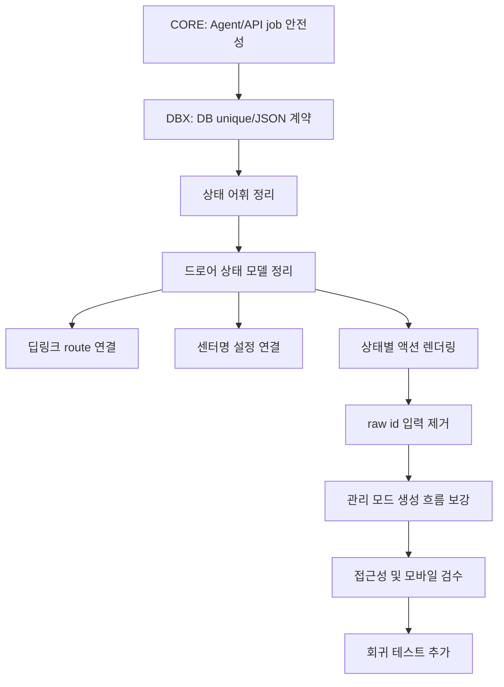

# UI/UX 기능 연결성 검토 및 상세 작업지시서

작성일: 2026-06-15
대상: `rider_server` Admin UI 전면 재구성 이후 기능 연결성
문서 목적: 개발자가 바로 구현에 들어갈 수 있도록, 끊긴 기능 흐름을 근거와 함께 작업 단위로 정리한다.
문서 상태: 역사적 작업지시서. 2026-06-15 당시 연결성 검토와 작업 항목을 보존한다.

> 최신화 메모(2026-06-18): 당시 차단 항목 중 Agent heartbeat lease 연장, snapshot complete
> atomicity, AUTH_CHECK 기본 runner 배선, Telegram 일반방 unique guard, Agent/channel registration
> unique guard, HTMX 정적 자산은 현재 코드에서 반영됐다. 최신 배포 판단은
> [refactoring_improvement_direction.md](./refactoring_improvement_direction.md)의 최신 상태표와
> release gate를 따른다. 이 문서의 상세 근거 표는 "당시 발견한 문제와 수락 기준"으로 읽는다.

---

## 1. 최종 판단

2026-06-15 당시 Admin UI 재개편은 큰 방향은 맞았다. `/admin` 화면, HTMX fragment, Admin action/CRUD route, Agent register/heartbeat/jobs API는 기본 happy path 기준으로 연결되어 있고, 전체 pytest도 통과했다.

당시에는 “릴리즈 가능”으로 보면 안 된다고 판단했다. UI에서 누르는 핵심 조치가 장시간 job, 인증 확인, DB 중복 방어선, 관리 화면 연속 생성 흐름까지 안전하게 이어지는지는 일부 깨져 있었다. 특히 아래 항목은 UI 표시 문제가 아니라 실제 운영 상태 불일치나 오발송 방어 실패로 이어질 수 있어 선행 처리해야 했다.

당시 릴리즈 차단 또는 준차단 항목:

1. Agent heartbeat의 `active_jobs`가 서버에서 lease 연장으로 연결되지 않는다.
2. snapshot result ingest가 queue `complete()`보다 먼저 commit된다.
3. Admin의 `인증 확인` 버튼이 만드는 `AUTH_CHECK` job이 기본 `python -m rider_agent run` 실행 경로에 배선되지 않았다.
4. Telegram 일반 채팅방(`thread_id=NULL`) 활성 채널 중복을 DB unique index가 막지 못한다.
5. Agent registration hash, channel registration code의 DB unique 방어선이 부족하다.
6. 관리 화면에서 새 계정/채널/업체를 만든 뒤 드롭다운이 즉시 갱신되지 않는다.

2026-06-18 현재에도 UX 정본에서 핵심으로 정한 다음 흐름은 별도 UI 실측과 운영자 승인 기준으로 확인해야 한다.

1. 텔레그램 알림에서 특정 업체 상세로 바로 들어가는 딥링크
2. 쿠팡 센터명 오류를 버튼 클릭 후 바로 수정하는 흐름
3. 비개발 운영자가 raw id를 직접 입력하지 않는 원칙
4. 로그인 만료, 센터명 불일치, 운영자 중지의 상태 의미 구분
5. 드로어와 target row의 접근성 구조
6. 드로어 안의 상태별 액션 노출
7. action 결과가 사용자가 누른 위치 근처에 보이는 피드백

따라서 이 작업지시서는 “UI가 보이는가”보다 “운영자가 한 상태에서 다음 조치까지 막히지 않는가”, 그리고 “그 조치가 Agent/API/DB까지 안전하게 완료되는가”를 기준으로 작성한다.

---

## 2. 당시 검토 결과 요약

| 구분 | 판단 | 근거 |
|---|---|---|
| 주요 API 연결 | 부분 정상 | `/v1/agents/register`, `/v1/agents/heartbeat`, `/v1/jobs/*` happy path 테스트는 통과. 단 active job lease 연장, snapshot ingest 순서, AUTH_CHECK runner 배선은 미완성 |
| Admin route 연결 | 대체로 정상 | `/admin/targets`, `/admin/entities`, CRUD/action POST route 존재 |
| UI 정보구조 | 부분 미완성 | 모니터링/관리 모드는 구현됐으나 raw id 패널과 별도 인증 표가 남아 있음 |
| 핵심 UX 흐름 | 일부 끊김 | 딥링크, 센터명 설정, 드로어 편집 탭이 실제 흐름으로 연결되지 않음 |
| 접근성 | 수정 필요 | 닫힌 드로어가 접근성 트리에 남고, row button 안에 실제 button이 중첩됨 |
| DB 연결 방어선 | 수정 필요 | Telegram `thread_id=NULL` 중복, Agent/channel registration code/hash unique 부족 |
| 관리 화면 연속 흐름 | 수정 필요 | 새 계정/채널/업체 생성 후 option select가 즉시 갱신되지 않고 tenant 없는 진입 흐름이 끊김 |
| 배포/정적 자산 | 보강 필요 | HTMX가 원격 major alias CDN에 의존. 외부 네트워크 차단 시 Admin action/polling이 멈춤 |
| 모바일 | 부분 통과 | 390px에서 카드형 목록은 보이나 상태 라벨과 닫힌 드로어 문제가 남음 |
| 문서 초기 버전 | 방향은 맞지만 상세도 부족 | 원인, 결정사항, 작업 순서, 테스트 케이스가 더 필요했음 |

---

## 3. 검증 근거

### 3.1 자동 테스트

실행한 명령:

```powershell
.venv\Scripts\python.exe -m pytest `
  tests/server/test_admin_dashboard.py `
  tests/server/test_admin_actions.py `
  tests/server/test_admin_entity_crud.py `
  tests/server/test_agents_api.py `
  tests/server/test_jobs_api.py `
  tests/agent/test_job_loop.py `
  tests/agent/test_heartbeat.py -q
```

결과:

```text
231 passed in 7.27s
```

의미:

- Admin 대시보드 fragment route는 기본 응답을 낸다.
- Admin action route는 service를 통해 동작한다.
- Admin entity CRUD route는 생성, 편집, 비활성화 경로를 갖는다.
- Agent 등록, heartbeat, job claim, complete, event 계약은 테스트상 연결된다.

주의:

- 이 테스트는 UI의 실제 사용자 흐름 전체를 보장하지 않는다.
- 특히 딥링크 자동 오픈, 드로어 접근성, row 안 button 중첩, 센터명 설정 UX는 별도 테스트가 필요하다.
- 이 테스트는 장시간 job lease 연장, snapshot 저장과 queue complete의 atomicity, AUTH_CHECK 기본 runner 배선, PostgreSQL unique edge case를 보장하지 않는다.

추가로 실행한 연결성 회귀:

```powershell
.venv\Scripts\python.exe -m pytest `
  tests/server/test_db_schema.py `
  tests/server/test_deployment_config.py `
  tests/server/test_queue_backend.py `
  tests/server/test_scheduler_tick.py `
  tests/server/test_scheduler_entrypoint.py `
  tests/agent/test_crawl_worker.py `
  tests/negative/test_messenger_channel_unique.py `
  tests/negative/test_security_pg.py -q
```

결과:

```text
128 passed, 24 skipped in 1.72s
```

전체 회귀:

```powershell
.venv\Scripts\python.exe -m pytest -q
```

결과:

```text
2014 passed, 52 skipped in 19.97s
```

해석:

- 자동 테스트 기준으로 현재 작업트리는 깨지지 않았다.
- `skipped`에는 `TEST_DATABASE_URL` 미설정 때문에 건너뛴 PostgreSQL-gated 검증이 포함된다.
- 2026-06-16 local Admin security fix evidence: this environment has no `TEST_DATABASE_URL`, so PostgreSQL-gated tests were not run locally and must run in CI/release environment.
- 아래 P0 DB unique 항목은 실제 PostgreSQL edge case라, 순수 in-memory 테스트 통과만으로 완료 처리하면 안 된다.

### 3.2 수동 UI 점검

검증 방식:

- 로컬 in-memory Admin 앱을 임시로 띄워 `/admin?tenant=tn-1` 확인
- Playwright CLI로 데스크톱과 모바일 390px viewport 점검
- 샘플 상태:
  - `AUTH_REQUIRED` 대상
  - `TARGET_VALIDATION_FAILURE` 대상
  - 정상 대상

수동 점검에서 확인한 문제:

- `AUTH_REQUIRED`, `TARGET_VALIDATION_FAILURE`가 KPI에서 `중지`로 보인다.
- `센터명 확인` 버튼은 드로어를 열 뿐, 센터명 수정 필드로 이어지지 않는다.
- 닫힌 드로어가 snapshot에서 계속 `dialog`로 노출된다.
- target row가 `role="button"`인데 내부에 실제 `<button>`이 있다.
- 드로어에는 모든 상태에서 같은 액션이 보인다.
- 딥링크 텍스트는 `/admin?tenant=...`만 보여 특정 업체를 열지 못한다.

---

## 4. UX 정본에서 반드시 지켜야 하는 원칙

출처: `_bmad-output/planning-artifacts/ux-designs/ux-rider_result_mornitoring-2026-06-15/EXPERIENCE.md`

| 원칙 | UX 정본 위치 | 구현에서 필요한 의미 |
|---|---:|---|
| 모바일과 데스크톱 둘 다 1급 | `EXPERIENCE.md:20` | 모바일에서 딥링크, 드로어, 1탭 조치가 완결되어야 한다. |
| 업체 상세 드로어는 딥링크 진입 가능 | `EXPERIENCE.md:33`, `:37`, `:124` | `/admin/t/{target}`류 안정 URL이 필요하다. |
| 상태별 상황맞춤 액션 | `EXPERIENCE.md:61`, `:87` | 상태마다 지금 눌러야 할 1차 버튼이 달라야 한다. |
| 드로어에 상세/편집 탭 | `EXPERIENCE.md:64` | 센터명 설정 같은 편집이 드로어 안에서 가능해야 한다. |
| raw id 타이핑 제거 | `EXPERIENCE.md:83`, `:91`, `:141` | 운영자가 UUID를 직접 입력하는 패널은 제거 또는 숨김 처리한다. |
| 접근성 하한 | `EXPERIENCE.md:93` | Esc 닫기, focus 처리, 보이는 focus, 닫힌 드로어 숨김이 필요하다. |
| 쿠팡 센터명 미설정은 오발송 위험 | `EXPERIENCE.md:150` | `센터명 설정` 액션이 실제 수정 route와 연결되어야 한다. |

---

## 5. 당시 구현 근거

| 구현 항목 | 현재 위치 | 확인 내용 |
|---|---:|---|
| target row 전체 클릭 | `src/rider_server/admin/templates/_targets.html:8` | `.trow`가 `role="button"`이며 `openTargetDrawer(this)` 호출 |
| row 안 인증 확인 버튼 | `_targets.html:45-47` | `/admin/targets/{id}/auth-check`에 HTMX POST |
| row 안 센터명 확인 버튼 | `_targets.html:48-49` | 드로어만 열고 수정으로 이어지지 않음 |
| row 안 활성화 버튼 | `_targets.html:50-53` | `/admin/targets/{id}/activate`에 HTMX POST |
| row 안 지금 수집 버튼 | `_targets.html:54-57` | `/admin/targets/{id}/test-crawl`에 HTMX POST |
| 드로어 선언 | `dashboard.html:373` | `role="dialog"`, `aria-modal="true"`이나 닫힘 상태 숨김 없음 |
| 드로어 딥링크 텍스트 | `dashboard.html:482` | `/admin?tenant=...`만 표시 |
| 드로어 액션 | `dashboard.html:391-394` | 모든 상태에서 인증 확인, 지금 수집, 미리보기, 비활성화 표시 |
| 전역 action 결과 | `dashboard.html:399`, `:490` | 대부분 `#action-result`로 결과 표시 |
| raw id 액션 패널 | `_actions.html:8`, `:18`, `:27`, `:30`, `:31` | subscription/job/dispatch/target/agent id 직접 입력 |
| 템플릿 raw id | `_entity_admin.html:41` | `메시지 템플릿 id` 직접 입력 |
| 인증 필요 별도 표 | `dashboard.html:355`, `_auth_required.html:16` | target id가 별도 표에 노출 |
| fail-closed severity | `severity.py:148-156` | fail-closed 신호를 `STOPPED`로 반환 |
| `STOPPED` 라벨 | `routes.py:49-50` | `STOPPED`를 `중지`로 표시 |

### 5.1 서버/API/Agent/DB 연결 근거

| 구현 항목 | 현재 위치 | 확인 내용 |
|---|---:|---|
| Agent active job 보고 | `src/rider_agent/job_loop.py:451-461`, `src/rider_agent/heartbeat.py:157-164` | Agent는 heartbeat에 `active_jobs`를 싣지만 서버 heartbeat에서 lease 연장 호출이 없다 |
| 서버 heartbeat 처리 | `src/rider_server/api/agents.py:93-120` | `AgentRegistry.heartbeat()`만 호출하고 `QueueBackend.extend_lease()`를 호출하지 않는다 |
| queue lease 연장 계약 | `src/rider_server/queue/backend.py:136-144` | 연장 API는 이미 있으나 heartbeat와 연결되지 않았다 |
| snapshot ingest 순서 | `src/rider_server/api/jobs.py:195-245` | `ingest_service.commit()`이 `backend.complete()`보다 먼저 실행된다 |
| 인증 확인 job 생성 | `src/rider_server/admin/templates/_targets.html:44-47`, `src/rider_server/services/admin_action_service.py:533-535` | UI는 `AUTH_CHECK` job을 만들 수 있다 |
| 기본 agent runner | `src/rider_agent/__main__.py:145-152` | 기본 CLI는 crawl/kakao worker만 켜고 auth executor는 합성하지 않는다 |
| 기본 executor | `src/rider_agent/job_loop.py:234-245` | 미지원 job type은 `UNSUPPORTED_JOB_TYPE`으로 실패한다 |
| Agent version heartbeat | `src/rider_agent/heartbeat.py:157-164`, `src/rider_server/api/agents.py:34-40` | Agent는 `agent_version`을 보내지만 서버 heartbeat 모델이 받지 않는다 |
| Telegram active channel unique | `migrations/versions/0004_messenger_channel_registration.py:42-47` | `(telegram_chat_id, thread_id)` unique라 `thread_id=NULL` 중복을 PostgreSQL이 허용한다 |
| Agent registration hash | `migrations/versions/0006_agent_registration_contract.py:27-33`, `src/rider_server/services/agent_registry_postgres.py:48` | `registration_code_hash`, `token_hash` unique가 없는데 조회는 단일 row를 전제한다 |
| Channel registration code | `migrations/versions/0004_messenger_channel_registration.py:37-39`, `src/rider_server/services/channel_repository_postgres.py:55-57` | `registration_code` unique가 없고 중복 시 의도하지 않은 채널에 붙을 수 있다 |
| 관리 드롭다운 갱신 | `src/rider_server/admin/templates/_entity_admin.html:14`, `:33`, `:38`, `:70`, `:93`, `:118` | option select는 `load` 1회만 실행되고 생성 폼은 결과 fragment만 갱신한다 |
| tenant 없는 관리 진입 | `src/rider_server/admin/routes.py:184`, `_entity_admin.html:142` | 고객 생성 후 현재 tenant context가 새 tenant로 바뀌지 않는다 |
| HTMX 로딩 | `src/rider_server/admin/templates/dashboard.html:9` | `https://unpkg.com/htmx.org@2` major alias CDN에 의존한다 |

---

## 6. 권장 구현 순서

작업은 아래 순서로 진행한다. 이유는 앞 작업이 뒤 작업의 기준이 되기 때문이다. UI만 먼저 다듬으면 버튼은 좋아 보이지만 장시간 job, 인증 확인, DB 중복 방어가 실제 운영에서 깨질 수 있다.



구현 권장:

1. 먼저 Agent/API/DB 연결 안전성을 막는다.
2. 상태 어휘를 정한다.
3. target row와 drawer가 같은 상태 모델을 쓰게 한다.
4. 딥링크와 센터명 설정을 연결한다.
5. raw id 패널을 제거하거나 숨긴다.
6. 접근성, 모바일, 테스트를 잠근다.

---

## 7. 상세 작업 항목

### CORE-01. Agent heartbeat `active_jobs`를 lease 연장으로 연결

우선순위: P0
위험도: 높음
영향: 장시간 수집 job이 lease 만료 후 재할당되거나 complete 409로 실패할 수 있음

#### 현재 상태

Agent는 heartbeat payload에 실행 중 job을 보낸다.

```json
{"active_jobs": [{"job_id": "...", "lease_expires_at": "..."}]}
```

하지만 서버의 `/v1/agents/heartbeat`는 `AgentRegistry.heartbeat()`만 호출하고, queue lease를 연장하지 않는다.

#### 요구 상태

서버 heartbeat가 인증된 `agent_id`의 active job마다 lease를 연장해야 한다.

정책:

- `QueueBackend.extend_lease(job_id, agent_id, DEFAULT_LEASE_SECONDS, now)`를 호출한다.
- non-owner, 이미 만료, 이미 완료된 job은 heartbeat 전체 실패로 만들지 않는다.
- 연장 실패는 서버 내부 metric/log/audit 후보로 남기되, heartbeat 응답은 200을 유지한다.
- `active_jobs`에 없는 job을 서버가 임의로 연장하지 않는다.

#### 작업 범위

- `src/rider_server/api/agents.py`
  - `_backend(request)` helper 추가 또는 jobs API helper 재사용
  - heartbeat 처리 후 active job lease 연장 loop 추가
- `src/rider_server/queue/backend.py`
  - 기존 `extend_lease()` 의미 유지
- `src/rider_server/queue/memory_queue.py`, `postgres_queue.py`
  - non-owner/expired 처리 결과가 테스트 가능해야 한다.

#### 테스트 지시

- `tests/server/test_agents_api.py`
  - heartbeat `active_jobs`가 in-flight job lease를 연장한다.
  - token agent와 body agent가 다르면 연장하지 않고 403이다.
  - 다른 agent가 가진 job은 연장하지 않는다.
  - 만료/완료 job은 heartbeat 200이되 lease는 변하지 않는다.
- `tests/server/test_queue_backend.py`
  - `extend_lease()`의 owner, status, expiry 조건을 memory/postgres 공통 계약으로 잠근다.

#### 완료 기준

- 120초를 넘는 crawl job도 heartbeat가 계속 들어오면 lease가 유지된다.
- stale recovery가 정상 실행 중인 job을 재할당하지 않는다.

---

### CORE-02. snapshot ingest와 queue complete를 atomic 경계로 정리

우선순위: P0
위험도: 높음
영향: snapshot은 저장됐지만 job은 `SUCCEEDED`가 아닌 불일치 상태가 생길 수 있음

#### 현재 상태

`/v1/jobs/{job_id}/complete`에서 snapshot result는 다음 순서로 처리된다.

1. `backend.in_flight_job()`으로 소유권 확인
2. `ingest_service.prepare_complete()`
3. `ingest_service.commit()`
4. `backend.complete()`

3번 후 4번이 409, 404, DB 오류로 실패하면 snapshot과 job 상태가 갈라진다.

#### 요구 상태

둘 중 하나를 택한다.

권장안:

- `backend.complete()`가 성공한 뒤 snapshot ingest를 commit한다.
- complete 실패 시 snapshot 저장은 0건이다.
- snapshot 저장 실패 시 job 상태를 어떻게 둘지 정책을 정한다. 권장 정책은 `SUCCEEDED`로 complete하지 않고 422/500으로 실패시켜 재시도 가능하게 둔다.

대안:

- PostgreSQL backend에서 queue complete와 snapshot insert를 같은 DB transaction으로 묶는다.
- memory backend는 테스트용 fake transaction 경계를 제공한다.

#### 작업 범위

- `src/rider_server/api/jobs.py`
- `src/rider_server/services/job_result_ingest_service.py`
- `src/rider_server/queue/postgres_queue.py`
- 필요 시 `PostgresSnapshotIngestRepository`

#### 테스트 지시

- `tests/server/test_jobs_api.py`
  - complete 409이면 `save_snapshot`이 호출되지 않는다.
  - complete 404이면 `save_snapshot`이 호출되지 않는다.
  - snapshot `target_id`가 job target과 다르면 complete도 snapshot 저장도 되지 않는다.
  - snapshot 저장 실패 시 job 상태 정책을 검증한다.
- PostgreSQL 경로는 `TEST_DATABASE_URL`이 있을 때 transaction rollback을 확인한다.

#### 완료 기준

- job 상태와 snapshot 저장이 서로 다른 진실을 만들지 않는다.
- crash/retry 시 중복 snapshot 또는 유령 snapshot이 생기지 않는다.

---

### CORE-03. Admin `인증 확인` job을 기본 Agent runner에 배선

우선순위: P0
위험도: 높음
영향: 운영자가 가장 먼저 누르는 `인증 확인` 버튼이 실제 Agent에서 `UNSUPPORTED_JOB_TYPE`으로 실패할 수 있음

#### 현재 상태

Admin UI의 `인증 확인`은 `/admin/targets/{id}/auth-check`를 호출하고, service는 `AUTH_CHECK` job을 enqueue한다. 하지만 `python -m rider_agent run` 기본 경로는 crawl/kakao worker만 켜고 auth executor를 합성하지 않는다.

#### 요구 상태

기본 Agent runner에서 `AUTH_CHECK`와 `OPEN_AUTH_BROWSER`가 auth executor로 라우팅되어야 한다.

#### 작업 범위

- `src/rider_agent/__main__.py`
  - `run_agent()` 호출 시 auth executor 구성 옵션을 켠다.
- `src/rider_agent/job_loop.py`
  - `build_auth_execute_job()` 합성 순서가 crawl/kakao fallback과 충돌하지 않게 한다.
- `src/rider_agent/auth/baemin_auth.py`
  - 기존 auth executor 계약을 재사용한다.

#### 테스트 지시

- `tests/agent/test_job_loop.py`
  - `AUTH_CHECK` job이 기본 runner 합성에서 unsupported로 떨어지지 않는다.
  - crawl/kakao job fallback 순서가 유지된다.
- `tests/agent/test_baemin_auth.py`
  - auth executor 결과 shape가 complete body와 맞는다.
- `tests/server/test_admin_actions.py`
  - `/admin/targets/{id}/auth-check`가 만든 job type과 Agent capability가 일치한다.

#### 완료 기준

- Admin의 `인증 확인` 버튼에서 생성된 job이 기본 Agent 실행 파일에서 실제 auth 결과로 complete된다.

---

### CORE-04. heartbeat `agent_version` 저장 계약 추가

우선순위: P2
위험도: 중간
영향: Agent 업그레이드/다운그레이드 drift를 Admin에서 판단하기 어려움

#### 현재 상태

Agent heartbeat payload는 `agent_version`을 보내지만 서버 `HeartbeatRequest`, `HeartbeatInput`, registry 저장 경로가 이를 받지 않는다.

#### 요구 상태

- heartbeat request/input에 `agent_version`을 추가한다.
- registry는 `agents.version` 또는 `capacity_json.version` 중 한 곳에 저장한다.
- 등록 시 version과 heartbeat version이 달라지면 최신 heartbeat version을 기준으로 Admin 표시를 갱신한다.

#### 테스트 지시

- `tests/server/test_agents_api.py`
  - heartbeat `agent_version`이 저장/갱신된다.
  - version 누락은 기존 Agent 호환을 위해 허용한다.

#### 완료 기준

- Admin Agent fleet에서 version drift 판단에 쓸 수 있는 최신 version 값이 있다.

---

### DBX-01. Telegram 활성 채널 unique를 `thread_id=NULL`까지 막기

우선순위: P0
위험도: 높음
영향: 같은 Telegram 일반 채팅방으로 중복 활성 채널이 생겨 오발송/중복 발송 scope가 깨질 수 있음

#### 현재 상태

`migrations/versions/0004_messenger_channel_registration.py`는 활성 Telegram 채널에 `(telegram_chat_id, thread_id)` partial unique index를 만든다. PostgreSQL은 unique index에서 `NULL`을 서로 다른 값으로 보므로 `thread_id=NULL` 중복을 막지 못한다.

#### 요구 상태

아래 중 하나로 고친다.

권장안:

```sql
CREATE UNIQUE INDEX ... ON messenger_channels (telegram_chat_id, coalesce(thread_id, ''))
WHERE messenger = 'TELEGRAM' AND state = 'ACTIVE';
```

대안:

- `thread_id`를 저장 전 빈 문자열로 정규화한다.
- 단, service가 `None`과 빈 문자열을 같은 route로 보는 정책과 DB 정책이 반드시 일치해야 한다.

#### 테스트 지시

- `tests/negative/test_messenger_channel_unique.py`
  - ACTIVE same `telegram_chat_id`, `thread_id=None` 2건 insert가 PostgreSQL에서 `IntegrityError`여야 한다.
  - `thread_id="7"` 기존 중복 테스트는 유지한다.
  - `INACTIVE`는 중복 가능 정책을 유지한다.

#### 완료 기준

- Telegram `chat_id + topic 없음` 활성 채널은 DB에서 1개만 존재할 수 있다.

---

### DBX-02. Agent/channel 등록 코드와 token hash unique 방어선 추가

우선순위: P0
위험도: 높음
영향: 등록 코드 중복 시 `/v1/agents/register` 또는 `/register <code>`가 의도하지 않은 대상에 붙거나 500성 오류가 날 수 있음

#### 현재 상태

- `agents.registration_code_hash` unique 없음
- `agents.token_hash` unique 없음
- `messenger_channels.registration_code` unique 없음
- Postgres repository는 각각 단일 row 조회를 전제한다.

#### 요구 상태

부분 unique index를 추가한다.

- `agents.registration_code_hash` where not null
- `agents.token_hash` where not null
- `messenger_channels.registration_code` where not null

기존 데이터에 중복이 있을 수 있으므로 migration은 중복 탐지 메시지를 명확히 해야 한다.

#### 작업 범위

- 신규 Alembic revision 추가 권장
- `src/rider_server/services/agent_registration_admin.py`
  - seed 전 중복 code를 service level에서도 4xx/명확한 예외로 막는다.
- `src/rider_server/services/channel_registration.py` 또는 repository
  - channel registration code 중복을 명확히 거부한다.

#### 테스트 지시

- `tests/server/test_db_schema.py`
  - unique index 존재 확인
- `tests/server/test_agent_registration_admin.py`
  - 중복 registration code 거부
- `tests/server/test_agents_api.py`
  - 중복 registration hash가 API 4xx로 매핑되는지 확인
- `tests/negative/test_messenger_channel_unique.py`
  - channel registration code 중복 insert 차단

#### 완료 기준

- 등록 코드/토큰 hash는 DB와 service 양쪽에서 단일 대상만 가리킨다.

---

### DBX-03. jobs JSON 컬럼 타입 가드 보강

우선순위: P1
위험도: 중간
영향: Agent job payload/result 계약이 깨져도 schema guard가 잡지 못할 수 있음

#### 현재 상태

`tests/server/test_db_schema.py`의 `EXPECTED_JSON_COLUMNS`가 `jobs.result_json`, `jobs.payload_json`을 빠뜨렸다.

#### 요구 상태

`EXPECTED_JSON_COLUMNS`에 아래를 추가한다.

- `("jobs", "result_json")`
- `("jobs", "payload_json")`

#### 테스트 지시

- `tests/server/test_db_schema.py::test_json_columns_use_portable_json_type`

#### 완료 기준

- job payload/result 컬럼이 portable JSON 타입으로 고정된다.

---

### ADX-01. 관리 화면 생성 후 option select와 목록 partial 즉시 갱신

우선순위: P1
위험도: 중간
영향: 새 계정/채널/업체 생성 후 다음 단계 드롭다운에 새 항목이 안 떠서 흐름이 끊김

#### 현재 상태

관리 화면 select는 `hx-trigger="load"`로 1회만 options를 불러온다. 생성 폼은 `#entity-result`만 갱신한다.

#### 요구 상태

생성/편집/비활성화 성공 후 관련 options와 목록이 같이 갱신되어야 한다.

권장 구현:

- CRUD route 성공 응답에 `HX-Trigger: admin-entity-changed`를 붙인다.
- options select는 `hx-trigger="load, admin-entity-changed from:body"`를 사용한다.
- target list, entity list도 필요한 경우 같은 event로 refresh한다.

#### 테스트 지시

- `tests/server/test_admin_entity_crud.py`
  - create route 응답에 `HX-Trigger`가 있다.
- Playwright
  - 새 계정 생성 직후 새 업체 추가 select에 새 계정이 보인다.
  - 새 채널 생성 직후 전송 연결 select에 새 채널이 보인다.

#### 완료 기준

- 새 업체 등록 흐름에서 페이지 새로고침이 필요 없다.

---

### ADX-02. tenant 없는 `/admin` 진입의 관리 흐름 결정

우선순위: P1
위험도: 중간
영향: 고객 생성 후에도 이후 POST가 `tenant=` 빈 값으로 나가 계정/업체 생성이 이어지지 않음

#### 현재 상태

`tenant`는 query parameter에서만 읽고 template의 POST URL에 렌더 시점 값으로 고정된다. tenant 없이 `/admin`에 들어와 고객을 만들면 현재 화면 context는 새 tenant로 바뀌지 않는다.

#### 요구 상태

단일 운영자/단일 고객 원칙을 고려해 둘 중 하나를 선택한다.

권장안:

- `/admin` 진입 시 tenant가 없고 tenant가 1개면 자동으로 그 tenant를 선택한다.
- tenant가 0개이면 고객 생성 후 `/admin?tenant={new_tenant}`로 redirect 또는 `HX-Redirect`한다.

대안:

- 관리 화면 상단에 tenant 선택 select를 둔다.
- 단, UX 정본은 tenant 전환 UI 불필요를 말하므로 단일 고객 운영이면 권장안이 더 맞다.

#### 테스트 지시

- `tests/server/test_admin_dashboard.py`
  - tenant가 없고 단일 tenant면 `/admin`이 그 tenant context로 렌더된다.
- `tests/server/test_admin_entity_crud.py`
  - 고객 생성 후 `HX-Redirect` 또는 equivalent response가 있다.

#### 완료 기준

- `/admin` 무tenant 진입에서도 고객 생성 후 계정/업체/채널 생성이 같은 흐름으로 이어진다.

---

### ADX-03. HTMX 정적 자산 pinning 또는 fallback

우선순위: P2
위험도: 중간
영향: CDN 장애/차단 또는 major alias 변경 시 Admin polling/action이 모두 멈춤

#### 현재 상태

`dashboard.html`은 `https://unpkg.com/htmx.org@2`를 직접 로드한다.

#### 요구 상태

아래 중 하나를 택한다.

권장안:

- `src/rider_server/admin/static/htmx.min.js`로 exact version을 vendor한다.
- FastAPI static route로 제공한다.
- 외부 네트워크 없이 `/admin` action/polling이 동작한다.

대안:

- exact version URL + SRI + local fallback을 둔다.

#### 테스트 지시

- CDN 차단 환경에서 Playwright smoke
- `/admin` HTML에 major alias가 아닌 exact asset이 포함되는지 route test

#### 완료 기준

- 외부 네트워크가 없어도 Admin UI의 HTMX 기능이 동작한다.

---

### ADX-04. Admin POST CSRF/Origin 정책 확정

우선순위: P2
위험도: 배포 인증 방식에 따라 중간~높음
영향: cookie/session 기반 Admin 인증이면 외부 사이트가 state-changing POST를 유도할 수 있음

#### 현재 상태

Admin write guard는 role, MFA, IP allowlist 중심이다. CSRF token 또는 Origin/Referer guard는 보이지 않는다.

#### 결정 필요

- Admin 인증이 bearer/header 기반이면 CSRF 위험은 낮다.
- Admin 인증이 cookie/session 기반이면 CSRF 또는 Origin/Referer allow guard가 필요하다.

#### 작업 지시

1. 배포 인증 방식을 문서화한다.
2. cookie/session이면 모든 `/admin/**` state-changing POST에 Origin/Referer allow guard 또는 CSRF token을 적용한다.
3. HTMX 요청은 정상 Origin에서만 통과해야 한다.

#### 테스트 지시

- `tests/server/test_admin_security.py`
  - 허용 Origin POST 200
  - 외부 Origin POST 403
  - Origin 없는 same-site 운영 요청 정책 명확화

#### 완료 기준

- 배포 인증 방식과 CSRF/Origin 정책이 코드와 문서에 일치한다.

---

### UIX-01. 업체 상세 딥링크를 실제 target 상세로 연결

우선순위: P0
위험도: 높음
영향: 텔레그램 알림에서 모바일로 바로 조치하는 J3 흐름이 막힘

#### 현재 상태

`dashboard.html:482`에서 드로어에 다음 형태의 텍스트만 표시한다.

```text
딥링크(텔레그램 알림): /admin?tenant=tn-1
```

이 URL은 특정 target을 지정하지 않는다. 따라서 알림을 눌러도 해당 업체 드로어가 바로 열리지 않는다.

#### 요구 상태

아래 중 하나를 정본으로 정하고 구현한다.

권장안:

```text
/admin/t/{target_id}?tenant={tenant_id}
```

대안:

```text
/admin?tenant={tenant_id}&target={target_id}
```

권장은 `/admin/t/{target_id}`이다. 이유는 알림 링크가 짧고, target 상세 진입이라는 의미가 URL에 명확히 드러나기 때문이다.

#### 작업 범위

- `src/rider_server/admin/routes.py`
  - `GET /admin/t/{target_id}` route 추가 또는 query parameter 처리 추가
  - 존재하지 않는 target 처리 정책 추가
- `src/rider_server/admin/templates/dashboard.html`
  - 초기 렌더 시 `initial_target_id`를 JS에 전달
  - 렌더 후 해당 row를 찾아 `openTargetDrawer(row)` 호출
  - 딥링크 텍스트를 실제 target URL로 변경
- `src/rider_server/admin/dashboard_service.py`
  - 필요하면 target 단건 조회 helper 추가
  - 가능하면 기존 `target_rows` 결과 안에서 찾고, 새 repository method는 최소화한다.

#### 구현 지시

1. URL 정본을 `/admin/t/{target_id}?tenant={tenant_id}`로 정한다.
2. route는 기존 `/admin` full page와 같은 template을 렌더하되, context에 `initial_target_id`를 넣는다.
3. template에는 `window.__INITIAL_TARGET_ID__` 같은 짧은 전역 값을 둔다.
4. `DOMContentLoaded` 또는 script 마지막에서 `openInitialTarget()`을 실행한다.
5. target row가 아직 HTMX polling 전이어도 최초 HTML에 포함된 row를 찾을 수 있어야 한다.
6. row를 찾지 못하면 전역 toast가 아니라 workbench 상단에 “업체를 찾지 못했습니다”를 표시한다.

#### 테스트 지시

- `tests/server/test_admin_dashboard.py`
  - `GET /admin/t/{target_id}?tenant=tn-1`이 200을 반환한다.
  - 응답 HTML에 `initial_target_id` 또는 equivalent boot 값이 있다.
  - 없는 target의 처리 정책을 테스트한다. 404를 택하면 404, 목록 화면 안내를 택하면 안내 문구를 검증한다.
- Playwright
  - 데스크톱에서 딥링크 접속 시 드로어가 열린다.
  - 모바일 390px에서 딥링크 접속 시 드로어가 전체폭으로 열린다.

#### 완료 기준

- 텔레그램 알림 링크가 특정 target으로 직접 진입한다.
- 모바일에서 링크 탭 후 바로 `인증 확인` 또는 `센터명 설정`을 누를 수 있다.

---

### UIX-02. `센터명 확인`을 `센터명 설정` 실제 수정 흐름으로 연결

우선순위: P0
위험도: 높음
영향: 쿠팡 오발송 위험을 화면에서 발견해도 바로 고칠 수 없음

#### 현재 상태

`_targets.html:49`의 버튼은 `openTargetDrawer()`만 실행한다.

```html
<button ...>센터명 확인</button>
```

드로어에는 센터명 수정 입력이 없다. 관리 모드에는 target 편집 select가 있지만, 현재 대상이 자동 선택되지 않는다.

#### 요구 상태

버튼 문구와 동작을 모두 `센터명 설정`으로 바꾼다.

사용자 흐름:

1. 쿠팡 target row에 “센터/상점명 불일치, 오발송 위험”이 보인다.
2. 운영자가 `센터명 설정`을 누른다.
3. 같은 드로어의 `편집` 탭이 열린다.
4. 센터/상점명 input에 focus가 간다.
5. 저장하면 `POST /admin/monitoring-targets/{target_id}`가 호출된다.
6. 성공 결과가 드로어 안에 보인다.
7. target fragment가 갱신된다.

#### 작업 범위

- `src/rider_server/admin/templates/_targets.html`
  - 버튼 label 변경
  - 버튼에서 `openTargetDrawer(row, { tab: "edit", focus: "center" })` 형태로 호출
- `src/rider_server/admin/templates/dashboard.html`
  - 드로어 `상세`/`편집` 탭 추가
  - 편집 탭에 센터/상점명 input 추가
  - 저장 함수 추가
  - 성공 후 `#targets` fragment refresh
- `src/rider_server/admin/crud_routes.py`
  - 기존 `POST /admin/monitoring-targets/{target_id}`를 사용
  - route 변경이 필요한지 확인하되, 가능하면 새 route를 만들지 않는다.

#### 구현 지시

1. 드로어에 tablist를 추가한다.
2. 기본 tab은 `상세`이다.
3. `TARGET_VALIDATION_FAILURE` 또는 빈 center인 경우 `센터명 설정` 버튼은 `편집` tab을 바로 연다.
4. 편집 tab의 저장 버튼은 `htmx.ajax("POST", "/admin/monitoring-targets/{id}?tenant={tenant}", ...)`를 사용한다.
5. 저장 성공 후 `#drawer-result`에 결과를 표시한다.
6. 저장 성공 후 `htmx.trigger("#targets", "refresh")` 또는 명시적 `htmx.ajax("GET", "/admin/targets?...")`로 목록을 갱신한다.

#### 테스트 지시

- `tests/server/test_admin_entity_crud.py`
  - `POST /admin/monitoring-targets/{target_id}`가 `center_name`을 갱신하는 기존 테스트를 확인 또는 보강한다.
- `tests/server/test_admin_dashboard.py`
  - `_targets.html` 렌더 결과에서 `TARGET_VALIDATION_FAILURE`는 `센터명 설정` 버튼을 보여준다.
  - 드로어 편집 탭 HTML이 렌더된다.
- Playwright
  - `센터명 설정` 클릭 후 input focus 확인
  - 값 입력 후 저장, 결과 표시 확인

#### 완료 기준

- 센터명 문제는 목록에서 발견 후 같은 화면에서 수정까지 끝난다.
- 운영자는 target id를 복사하지 않는다.

---

### UIX-03. raw id 직접 입력 패널 제거 또는 관리자 전용으로 격리

우선순위: P0
위험도: 높음
영향: 재개편의 핵심 원칙인 “비개발 운영자용 UI”가 깨짐

#### 현재 상태

`_actions.html`에 다음 직접 입력이 남아 있다.

- `subscription_id`
- `dispatch_id`
- `job_id`
- `target_id`
- `agent_id`

위치:

- `src/rider_server/admin/templates/_actions.html:8`
- `src/rider_server/admin/templates/_actions.html:18`
- `src/rider_server/admin/templates/_actions.html:27`
- `src/rider_server/admin/templates/_actions.html:30`
- `src/rider_server/admin/templates/_actions.html:31`

#### 요구 상태

일반 운영자 화면에서는 raw id 입력이 없어야 한다.

허용되는 방식:

- row 선택
- 검색형 select
- 드로어 안 버튼
- 이름, 상태, 시간 기준의 사람이 읽는 목록

#### 작업 범위

- `src/rider_server/admin/templates/_actions.html`
  - 일반 화면에서 제거하거나 권한/환경 조건으로 숨김
- `src/rider_server/admin/templates/dashboard.html`
  - `고급 운영 액션` details 자체의 노출 정책 결정
- `src/rider_server/admin/actions_routes.py`
  - route는 유지해도 된다. UI 노출만 바꾸는 것이 우선이다.

#### 권장 결정

`_actions.html`은 삭제하지 말고 `SECRET_ADMIN` 또는 local debug flag가 있을 때만 보이게 한다.

이유:

- route와 테스트는 이미 있다.
- 운영 장애 시 raw id 조작이 필요할 수 있다.
- 하지만 일반 Admin UI 첫 화면에는 나오면 안 된다.

#### 구현 지시

1. `dashboard.html`에서 `show_debug_actions` context 값이 true일 때만 `_actions.html`을 include한다.
2. 기본값은 false로 둔다.
3. `show_debug_actions`는 환경 변수 또는 principal role로 결정한다.
4. 일반 운영자에게는 subscription/job/dispatch 조작을 target drawer 또는 상태별 리스트로 제공한다.

#### 테스트 지시

- 일반 OPERATOR principal에서 `_actions.html` raw input이 렌더되지 않는다.
- debug flag 또는 SECRET_ADMIN 조건에서만 렌더된다.
- 기존 action route 테스트는 유지한다.

#### 완료 기준

- `/admin` 기본 화면에서 raw UUID 입력란이 보이지 않는다.
- action route는 보안 게이트 뒤에서 계속 테스트된다.

---

### UIX-04. 상태 어휘를 `위험`, `자동차단`, `운영중지`로 분리

우선순위: P0
위험도: 높음
영향: 운영자가 “중지”를 실제 운영자가 끈 상태로 오해할 수 있음

#### 현재 상태

`severity.py:148-156`에서 fail-closed 신호가 있으면 `SEVERITY_STOPPED`를 반환한다.

`routes.py:49-50`에서 `SEVERITY_STOPPED`는 `중지`로 표시된다.

결과:

- `AUTH_REQUIRED`가 `중지`로 보인다.
- `TARGET_VALIDATION_FAILURE`가 `중지`로 보인다.
- 운영자가 실제로 비활성화한 상태와 자동 차단 상태가 같은 말로 보인다.

#### UX 정본과 충돌

`EXPERIENCE.md:150`은 쿠팡 센터명 미설정을 “위험(crit)”으로 취급하고, `센터명 설정` 액션을 띄우라고 한다.

동시에 `EXPERIENCE.md:79`는 인증 자동복구 실패 반복 시 중지 정책을 유지하라고 한다.

즉, 내부 상태는 fail-closed 차단일 수 있지만, 화면 라벨은 더 정확해야 한다.

#### 권장 결정

표시 라벨을 다음처럼 분리한다.

| 내부 원인 | 화면 주 라벨 | 보조 배지 | 1차 액션 |
|---|---|---|---|
| 최근 수집 지연 | 위험 | 수집 지연 | 지금 수집 |
| `AUTH_REQUIRED` | 위험 | 인증 필요 | 인증 확인 |
| `TARGET_VALIDATION_FAILURE` | 위험 | 오발송 차단 | 센터명 설정 |
| 운영자가 pause/deactivate | 운영중지 | 수동 중지 | 활성화 |

구현 방식은 두 가지 중 선택한다.

권장안:

- `severity`는 사용자의 긴급도 기준으로 `CRITICAL`을 반환한다.
- 별도 `blocking_state` 또는 `reason`으로 자동 차단 여부를 표시한다.

대안:

- `STOPPED`는 유지하되 화면 라벨을 `자동차단`으로 바꾸고, 실제 운영자 중지는 별도 상태로 분리한다.

#### 작업 범위

- `src/rider_server/admin/severity.py`
  - fail-closed 반환값 정책 수정 또는 표시 layer에서 분기
- `src/rider_server/admin/routes.py`
  - severity label, reason label 정리
- `src/rider_server/admin/templates/_targets.html`
  - 주 라벨과 보조 배지를 분리
- `tests/server/test_admin_dashboard.py`
  - 현재 `AUTH_REQUIRED -> STOPPED` 기대값 수정

#### 테스트 지시

- `AUTH_REQUIRED`는 “인증 필요” 문구와 `인증 확인` 버튼을 보여준다.
- `TARGET_VALIDATION_FAILURE`는 “오발송 차단” 또는 “센터명 불일치” 문구와 `센터명 설정` 버튼을 보여준다.
- 운영자 중지 상태는 `활성화` 버튼을 보여준다.

#### 완료 기준

- “중지”라는 말이 서로 다른 뜻으로 쓰이지 않는다.
- 운영자가 어떤 조치를 해야 하는지 라벨만 보고 알 수 있다.

---

### UIX-05. target row의 중첩 button 접근성 문제 수정

우선순위: P1
위험도: 중간
영향: 키보드, 스크린리더 사용자가 행과 버튼을 구분하기 어려움

#### 현재 상태

`_targets.html:8`에서 row 전체가 `role="button"`이다. 같은 row 안에 실제 `<button>`이 들어간다.

접근성 트리에서는 “버튼 안 버튼”처럼 보인다.

#### 요구 상태

HTML 구조상 interactive element가 중첩되지 않아야 한다.

#### 권장 구현

1. `.trow`의 `role="button"`을 제거한다.
2. row는 `article` 또는 `div`로 둔다.
3. 상세 열기에 명시적 `상세` 버튼을 둔다.
4. row 클릭 전체 열림을 유지하고 싶으면 pointer click만 사용하고, keyboard는 명시적 버튼으로 처리한다.
5. 모바일에서도 `상세` 버튼과 1차 액션 버튼이 모두 44px 이상이 되게 한다.

#### 작업 범위

- `src/rider_server/admin/templates/_targets.html`
- `src/rider_server/admin/templates/dashboard.html`의 CSS

#### 테스트 지시

- Playwright accessibility snapshot에서 row가 button으로 중첩되지 않는다.
- Tab 순서가 검색, 필터, row 액션, 상세 순으로 자연스럽다.

#### 완료 기준

- keyboard만으로 상세 열기와 1차 액션 실행이 모두 가능하다.
- screen reader에서 중첩 button 구조가 사라진다.

---

### UIX-06. 닫힌 드로어를 접근성 트리에서 숨기고 focus를 관리

우선순위: P1
위험도: 중간
영향: 닫힌 UI가 screen reader에 계속 읽힘

#### 현재 상태

`dashboard.html:373`의 드로어는 항상 DOM에 있다.

```html
<aside class="drawer" id="drawer" role="dialog" aria-label="업체 상세" aria-modal="true">
```

닫힘 상태는 class만 다르다. Playwright snapshot에서 닫힌 상태의 `dialog`와 버튼들이 계속 노출됐다.

#### 요구 상태

닫힌 드로어는 보조기기에 노출되지 않아야 한다.

#### 구현 지시

1. 초기 HTML에서 drawer에 `hidden` 또는 `inert aria-hidden="true"`를 부여한다.
2. `openTargetDrawer()`에서 hidden/inert/aria-hidden을 해제한다.
3. `closeDrawer()`에서 다시 hidden/inert/aria-hidden을 설정한다.
4. 열릴 때 focus를 닫기 버튼 또는 제목으로 이동한다.
5. 닫을 때 focus를 원래 클릭한 버튼 또는 row 상세 버튼으로 되돌린다.
6. 드로어가 열린 동안 focus trap을 적용한다.
7. Esc, 스크림 클릭, 닫기 버튼이 모두 같은 `closeDrawer()`를 타게 한다.

#### 테스트 지시

- 닫힌 상태 snapshot에 `dialog`가 없다.
- 드로어 열림 후 Esc로 닫힌다.
- 닫힌 후 focus가 호출 지점으로 돌아간다.
- 모바일 전체폭에서도 동일하게 동작한다.

#### 완료 기준

- 닫힌 드로어가 접근성 트리에 남지 않는다.
- 드로어 조작이 keyboard만으로 완결된다.

---

### UIX-07. 드로어 액션을 상태별로 제한

우선순위: P1
위험도: 중간
영향: 잘못된 액션을 눌러 운영 실수를 만들 수 있음

#### 현재 상태

`dashboard.html:391-394`에서 드로어는 모든 target에 같은 버튼을 보여준다.

- 인증 확인
- 지금 수집
- 미리보기
- 비활성화

정상 target에도 `인증 확인`이 보이고, 이미 중지된 target에도 `비활성화`가 보일 수 있다.

#### 요구 상태

row와 drawer가 같은 action policy를 사용해야 한다.

#### 권장 action policy

| 상태 조건 | 1차 액션 | 보조 액션 |
|---|---|---|
| `AUTH_REQUIRED` | 인증 확인 | 미리보기 |
| `TARGET_VALIDATION_FAILURE` | 센터명 설정 | 미리보기 |
| 운영중지 | 활성화 | 상세 |
| 수집 지연, 연속 실패 | 지금 수집 | 인증 확인, 미리보기 |
| 정상 | 상세 | 미리보기, 비활성화 |

#### 구현 지시

1. action policy를 JS에 흩뿌리지 않는다.
2. 최소 구현은 row `data-*`에 `primary_action` 값을 싣는 것이다.
3. 더 나은 구현은 Python helper가 row action model을 만들고 template이 렌더하는 것이다.
4. 드로어는 open 시 row action model을 읽어 버튼 영역을 다시 그린다.

#### 테스트 지시

- `AUTH_REQUIRED` 드로어에는 `인증 확인`이 1차로 보인다.
- `TARGET_VALIDATION_FAILURE` 드로어에는 `센터명 설정`이 1차로 보인다.
- 정상 target에는 `인증 확인`이 1차로 보이지 않는다.
- 운영중지 target에는 `활성화`가 보인다.

#### 완료 기준

- row와 drawer의 액션이 서로 다르지 않다.
- 잘못된 상태에서 위험 액션이 앞에 나오지 않는다.

---

### UIX-08. action 결과를 맥락 근처에 표시

우선순위: P1
위험도: 중간
영향: 운영자가 어떤 액션 결과인지 놓칠 수 있음

#### 현재 상태

대부분 액션 결과가 `#action-result` 전역 fixed toast로 간다.

근거:

- `_targets.html:46-57`
- `dashboard.html:399`
- `dashboard.html:490`
- `_actions.html:48`, `:53`

#### 요구 상태

결과는 사용자가 누른 버튼 근처에 보여야 한다.

#### 구현 지시

1. target row 안 또는 바로 아래에 `id="target-result-{target_id}"` 영역을 둔다.
2. 드로어 안에는 `id="drawer-result"`를 둔다.
3. row에서 누른 액션은 row result 영역에 표시한다.
4. 드로어에서 누른 액션은 drawer result 영역에 표시한다.
5. 전역 toast는 네트워크 장애나 예상 밖 오류용으로만 남긴다.

#### 테스트 지시

- row 인증 확인 후 해당 row 근처에 결과가 표시된다.
- drawer 지금 수집 후 drawer 안에 결과가 표시된다.
- `role="status"` 또는 `aria-live="polite"`가 유지된다.

#### 완료 기준

- 액션 결과 위치가 사용자의 클릭 맥락과 일치한다.

---

### UIX-09. 관리 모드의 신규 등록 흐름을 한 번에 끝나게 만들기

우선순위: P1
위험도: 중간
영향: 새 업체 추가 도중 계정/채널이 없으면 흐름이 끊김

#### 현재 상태

관리 모드에는 새 업체 추가 폼이 있지만, 계정과 채널이 없으면 접힌 보조 섹션으로 내려가야 한다.

또한 `메시지 템플릿 id`는 raw 입력이다.

근거:

- `_entity_admin.html:11-23`
- `_entity_admin.html:30-43`
- `_entity_admin.html:41`
- `_entity_admin.html:64`

#### 요구 상태

운영자는 다음 흐름을 한 자리에서 끝낸다.

1. 계정 선택 또는 `+ 새 계정 만들기`
2. 업체 정보 입력
3. 채널 선택 또는 `+ 새 채널 만들기`
4. 템플릿 선택 또는 기본 템플릿 사용
5. 저장
6. 모니터링 목록에서 새 업체 확인

#### 구현 지시

1. 계정 select의 빈 상태에 `+ 새 계정 만들기` CTA를 둔다.
2. 채널 select의 빈 상태에 `+ 새 채널 만들기` CTA를 둔다.
3. CTA 클릭 시 같은 관리 화면 안에서 inline 생성 폼을 펼친다.
4. 생성 성공 후 관련 select를 자동 재조회한다.
5. `메시지 템플릿 id`는 select로 바꾼다.
6. 템플릿 엔티티가 아직 없으면 field를 숨기고 server default를 사용한다.

#### 테스트 지시

- 계정 생성 후 platform account options에 새 계정이 나온다.
- 채널 생성 후 messenger channel options에 새 채널이 나온다.
- target 생성 후 monitoring target options와 target list가 갱신된다.

#### 완료 기준

- 새 업체 등록부터 전송 연결까지 raw id 없이 끝난다.

---

### UIX-10. 열린 드로어와 30초 polling 데이터 동기화

우선순위: P1
위험도: 중간
영향: 목록은 갱신됐는데 드로어는 오래된 정보를 보여줄 수 있음

#### 현재 상태

`dashboard.html:422`에서 `#targets` swap 후 `applyFilter()`만 호출한다. 열린 드로어는 row `data-*` 복사본이라 자동 갱신되지 않는다.

#### 요구 상태

`#targets`가 갱신되면 열린 드로어도 같은 target의 최신 row data로 갱신되어야 한다.

#### 구현 지시

1. 현재 열린 target id를 `ADM.target`에 유지한다.
2. `htmx:afterSwap`에서 target swap이면 `syncOpenDrawerFromRows()`를 호출한다.
3. 같은 target row를 찾으면 드로어 내용을 갱신한다.
4. row가 사라졌으면 “이 업체는 현재 목록에 없습니다”를 드로어에 표시하거나 드로어를 닫는다.
5. 액션 성공 후에도 같은 동기화 함수를 호출한다.

#### 테스트 지시

- 드로어가 열린 상태에서 target fragment가 교체되어도 드로어 내용이 최신화된다.
- target이 사라지면 stale 안내가 보인다.

#### 완료 기준

- 목록과 드로어의 상태가 30초 이상 엇갈리지 않는다.

---

### UIX-11. 인증 필요 별도 표를 target 중심 흐름으로 흡수

우선순위: P2
위험도: 낮음
영향: 정보가 두 군데로 나뉘어 운영자가 어디서 조치해야 하는지 헷갈림

#### 현재 상태

인증 필요 대상이 별도 접힘 표로 남아 있다. 표에는 target id가 보인다.

근거:

- `dashboard.html:352-356`
- `_auth_required.html:16`

#### 요구 상태

인증 필요는 target row의 필터, 배지, 액션으로 흡수한다.

#### 구현 지시

1. 인증 필요 details를 제거하거나 “인증 필요 바로가기” 리스트로 축소한다.
2. 리스트를 유지한다면 target id 대신 업체명, 사유, 조치 버튼을 보여준다.
3. 클릭 시 해당 target drawer를 연다.

#### 테스트 지시

- 인증 필요 필터 클릭 시 인증 필요 target만 보인다.
- 인증 필요 보조 리스트가 있으면 target drawer로 이동한다.

#### 완료 기준

- 인증 필요 조치는 target row 또는 drawer에서 끝난다.

---

### UIX-12. 모바일 상태 라벨과 터치 타깃 검수

우선순위: P2
위험도: 낮음
영향: 모바일 온콜에서 상태를 색만으로 판단할 수 있음

#### 현재 상태

390px viewport에서 target row는 카드형으로 보인다. 다만 상태 라벨이 데스크톱보다 약하게 보이고, 닫힌 드로어 접근성 문제는 동일하게 남아 있다.

#### 요구 상태

모바일에서 색을 보지 못해도 상태를 읽을 수 있어야 한다.

#### 구현 지시

1. 모바일 카드에도 상태 라벨 텍스트를 유지한다.
2. 1차 액션 버튼은 44px 이상 높이를 보장한다.
3. 드로어는 전체폭으로 열리고 body scroll 잠금을 적용한다.
4. 긴 업체명, 긴 센터명은 줄바꿈 또는 말줄임으로 처리한다.

#### 테스트 지시

- Playwright `resize 390 844`
- 정상, 인증 필요, 센터명 오류, 운영중지 row 확인
- 드로어 열기, 닫기, Esc, 스크림 클릭 확인

#### 완료 기준

- 모바일에서 J3 흐름이 1분 안에 끝난다.

---

## 8. 구현 시 지켜야 할 경계

### 8.1 건드리지 말아야 할 것

- Agent API 계약은 breaking change로 바꾸지 않는다. 단 `agent_version` heartbeat 수신, `active_jobs` lease 연장처럼 기존 Agent와 호환되는 additive 보강은 허용한다.
- `rider_agent`가 `rider_server`를 import하지 않는 규칙을 유지한다.
- secret, token, OTP, password를 화면, 로그, 예외, 딥링크에 노출하지 않는다.
- Admin route가 직접 ORM write를 하지 않는다. 쓰기는 service layer를 통한다.
- 새 frontend build system을 추가하지 않는다. 현재는 Jinja2, HTMX, inline CSS/JS 구조다.

### 8.2 재사용할 것

- 기존 Admin action route:
  - `/admin/targets/{target_id}/auth-check`
  - `/admin/targets/{target_id}/activate`
  - `/admin/targets/{target_id}/test-crawl`
  - `/admin/targets/{target_id}/dry-run`
  - `/admin/targets/{target_id}/pause`
- 기존 CRUD route:
  - `/admin/monitoring-targets`
  - `/admin/monitoring-targets/{target_id}`
  - `/admin/platform-accounts`
  - `/admin/messenger-channels`
  - `/admin/delivery-rules`
- 기존 options fragment:
  - `/admin/platform-accounts/options`
  - `/admin/monitoring-targets/options`
  - `/admin/messenger-channels/options`

---

## 9. 테스트 계획

### 9.1 단위 및 route 테스트

수정 후 최소 아래 테스트를 추가하거나 갱신한다.

| 테스트 파일 | 추가 검증 |
|---|---|
| `tests/server/test_agents_api.py` | heartbeat active job lease 연장, non-owner/expired 미연장, heartbeat `agent_version` 저장 |
| `tests/server/test_jobs_api.py` | complete 실패 시 snapshot 저장 미호출, snapshot target mismatch 차단, ingest/complete 순서 |
| `tests/server/test_queue_backend.py` | `extend_lease()` owner/status/expiry 계약 |
| `tests/agent/test_job_loop.py` | `AUTH_CHECK`/`OPEN_AUTH_BROWSER`가 기본 runner 합성에서 unsupported로 떨어지지 않음 |
| `tests/server/test_admin_dashboard.py` | 딥링크 route, 초기 target boot 값, 닫힌 드로어 hidden 상태, 상태별 action 렌더 |
| `tests/server/test_admin_entity_crud.py` | 센터명 수정 route, options 재조회, target 생성 후 목록 반영, CRUD 성공 `HX-Trigger` |
| `tests/server/test_admin_actions.py` | row/drawer action target이 기존 action route와 계속 연결됨 |
| `tests/server/test_admin_security.py` | raw id debug action 노출 조건, 권한 조건, Origin/CSRF 정책(적용 시) |
| `tests/server/test_db_schema.py` | jobs JSON 컬럼 guard, 신규 unique index 존재, migration head chain |
| `tests/server/test_deployment_config.py` | production DB 필수, migrate service, scheduler/backend-api compose 설정 |
| `tests/negative/test_messenger_channel_unique.py` | Telegram `thread_id=NULL` 중복 ACTIVE 차단, registration code 중복 차단 |

### 9.2 Playwright 수동 검수

데스크톱:

1. `/admin?tenant=tn-1` 접속
2. 검색, 플랫폼 필터, 인증필요 필터 확인
3. `AUTH_REQUIRED` row에서 `인증 확인` 실행
4. `TARGET_VALIDATION_FAILURE` row에서 `센터명 설정` 실행
5. 정상 row에서 상세 드로어 열기
6. 드로어 Esc 닫기 확인
7. 관리 모드에서 새 계정, 새 업체, 새 채널, 전송 연결 흐름 확인
8. 새 계정/채널 생성 후 select가 즉시 갱신되는지 확인
9. 네트워크 차단 환경에서 HTMX 로컬 asset/fallback 동작 확인

모바일:

1. viewport `390x844`
2. `/admin/t/{target_id}?tenant=tn-1` 접속
3. 드로어 전체폭 확인
4. 인증 확인 또는 센터명 설정 1탭 조치 확인
5. 닫힌 드로어가 접근성 snapshot에 남지 않는지 확인

### 9.3 회귀 명령

```powershell
.venv\Scripts\python.exe -m pytest `
  tests/server/test_admin_dashboard.py `
  tests/server/test_admin_actions.py `
  tests/server/test_admin_entity_crud.py `
  tests/server/test_admin_security.py `
  tests/server/test_agents_api.py `
  tests/server/test_jobs_api.py `
  tests/server/test_queue_backend.py `
  tests/server/test_db_schema.py `
  tests/server/test_deployment_config.py `
  tests/negative/test_messenger_channel_unique.py `
  tests/agent/test_job_loop.py `
  tests/agent/test_heartbeat.py `
  tests/agent/test_crawl_worker.py -q
```

가능하면 전체 테스트도 실행한다.

```powershell
.venv\Scripts\python.exe -m pytest -q
```

---

## 10. 완료 기준

이 작업은 아래 조건을 모두 만족해야 완료로 본다.

1. Agent heartbeat가 active job lease를 연장해 장시간 crawl job이 정상 유지된다.
2. snapshot 저장과 job complete가 불일치 상태를 만들지 않는다.
3. Admin `인증 확인` 버튼이 만든 job이 기본 Agent runner에서 실제 auth executor로 처리된다.
4. Telegram active channel, Agent registration hash, channel registration code 중복을 DB가 막는다.
5. 텔레그램 알림용 딥링크가 특정 업체 상세로 바로 열린다.
6. 모바일에서 딥링크 진입 후 1차 조치가 가능하다.
7. 센터명 미설정 또는 불일치 row에서 바로 센터명 설정을 완료할 수 있다.
8. 일반 운영자 화면에 raw id 입력란이 보이지 않는다.
9. 로그인 만료, 센터명 불일치, 운영자 중지 상태가 서로 다른 의미로 보인다.
10. target row에 중첩 button 접근성 문제가 없다.
11. 닫힌 드로어가 접근성 트리에 남지 않는다.
12. 드로어 action은 상태별로 제한된다.
13. action 결과가 row 또는 drawer 근처에 표시된다.
14. 관리 모드에서 새 업체 등록부터 전송 연결까지 raw id 없이 끝난다.
15. Admin/API/Agent/DB/배포 관련 회귀 테스트가 통과한다.
16. PostgreSQL-gated 테스트는 `TEST_DATABASE_URL`이 있는 환경에서 통과하거나, 미실행 사유를 릴리즈 노트에 명시한다.
17. Playwright 데스크톱, 모바일 수동 검수가 통과한다.

---

## 11. 작업 분할 권장

한 번에 모두 고치면 충돌과 회귀 위험이 크다. 아래처럼 PR 또는 커밋을 나눈다.

### 0차: 릴리즈 차단 연결성

- CORE-01 heartbeat active job lease 연장
- CORE-02 snapshot ingest와 queue complete 순서/atomicity
- CORE-03 auth-check executor 기본 runner 배선
- DBX-01 Telegram `thread_id=NULL` unique 방어
- DBX-02 Agent/channel registration unique 방어
- DBX-03 jobs JSON 컬럼 guard

### 1차: 상태와 드로어 기반 정리

- UIX-04 상태 어휘 정리
- UIX-05 row 접근성 구조 수정
- UIX-06 드로어 숨김 및 focus 관리
- UIX-07 드로어 상태별 action

### 2차: 핵심 흐름 연결

- UIX-01 딥링크
- UIX-02 센터명 설정
- UIX-08 맥락 근처 action 결과
- UIX-10 드로어 polling 동기화

### 3차: 관리 모드와 raw id 정리

- ADX-01 생성 후 option/list 갱신
- ADX-02 tenant 없는 `/admin` 진입 흐름
- UIX-03 raw id 패널 격리
- UIX-09 신규 등록 흐름
- UIX-11 인증 필요 표 흡수
- UIX-12 모바일 검수

### 4차: 배포·보안 운영 보강

- ADX-03 HTMX asset pinning/fallback
- ADX-04 Admin POST CSRF/Origin 정책
- CORE-04 heartbeat `agent_version` 저장 계약

---

## 12. 문서 자체 검토 결과

초기 작업지시서의 방향은 맞았다. 다만 아래 문제가 있었다.

| 문제 | 보강 내용 |
|---|---|
| 작업 항목은 있으나 구현 순서가 약함 | 권장 구현 순서와 작업 분할을 추가했다. |
| 각 항목의 현상과 기대 동작이 짧음 | 현재 상태, 요구 상태, 구현 지시, 테스트 지시, 완료 기준을 분리했다. |
| 상태 어휘 문제가 결정 대기 상태였음 | 권장 표시 정책을 추가했다. |
| 접근성 문제가 단순 지적에 가까움 | focus, hidden/inert, focus return, focus trap까지 구체화했다. |
| 테스트 범위가 넓게만 적혀 있음 | 파일별 추가 테스트와 Playwright 절차를 구체화했다. |
| UX 정본 근거가 부족함 | `EXPERIENCE.md`의 핵심 라인과 구현 파일 라인을 근거표로 추가했다. |
| UI 표면만 보고 API/Agent 연결을 정상으로 판단할 위험이 있었음 | CORE 항목으로 heartbeat lease, snapshot ingest, auth-check runner, agent version 계약을 추가했다. |
| DB 방어선과 UI 생성 흐름의 연결이 빠져 있었음 | DBX 항목으로 Telegram/registration unique와 jobs JSON guard를 추가했다. |
| 관리 화면의 연속 작업 흐름이 약했음 | ADX 항목으로 option refresh, tenant context, HTMX asset, CSRF/Origin 정책을 추가했다. |
| 테스트 통과 범위와 미검증 범위가 섞여 있었음 | 실제 실행 결과(`231 passed`, `128 passed/24 skipped`, `2014 passed/52 skipped`)와 PostgreSQL-gated 잔여 위험을 분리했다. |

현재 문서는 실행 작업지시서로 쓰기에 충분한 상세도를 갖는다. 구현자는 CORE, DBX, ADX, UIX 항목을 그대로 ticket으로 분리해 진행하면 된다.
